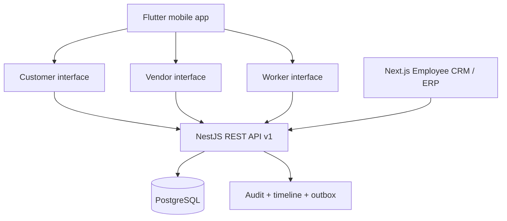
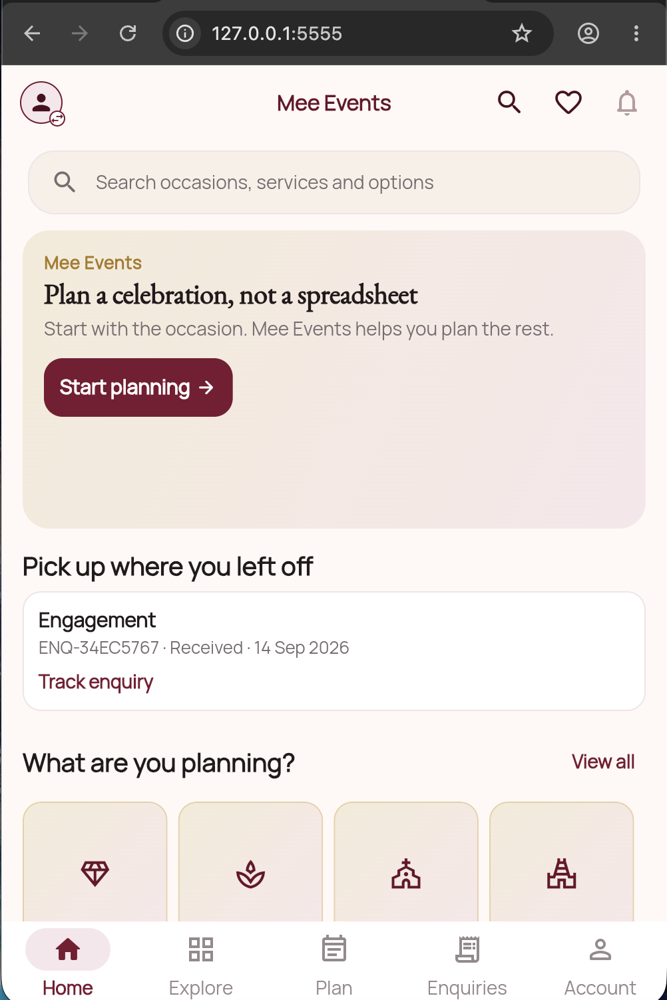
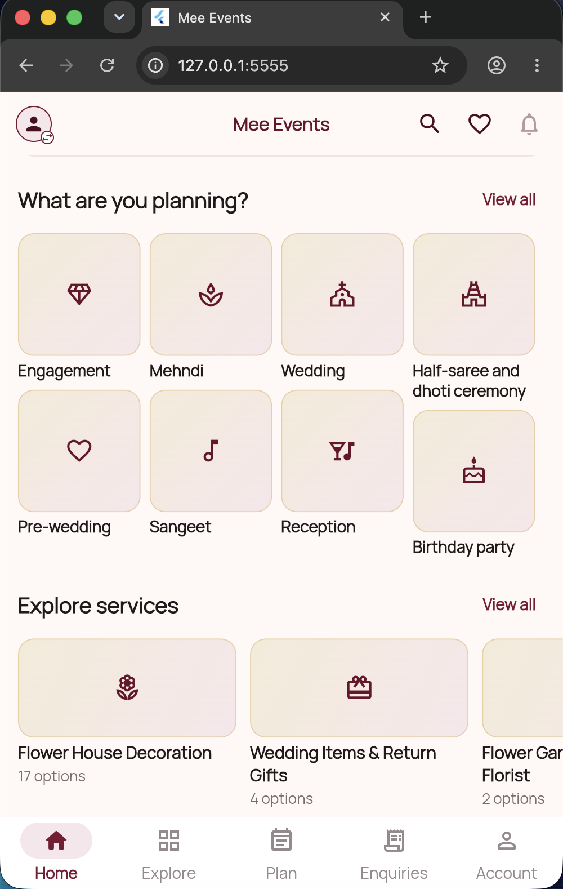
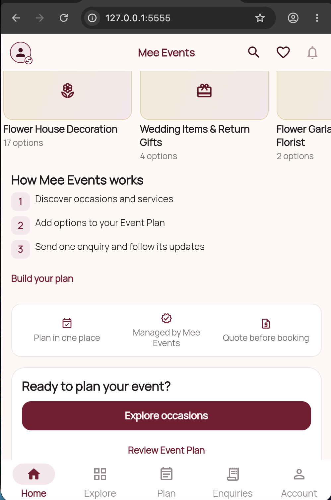

<p align="center">
  
</p>

<h1 align="center">Mee Events</h1>

<p align="center">
  A connected event operating system for customers, employees, vendors, and field workers.
</p>

<p align="center">
  <a href="https://github.com/mee-events/Mee-Events/actions/workflows/ci.yml"></a>
  
  
  
  
</p>

<p align="center"><strong>Private product repository · Hyderabad Phase 1 · Active development</strong></p>

---

## What Mee Events is

Mee Events is designed to connect the complete event lifecycle in one platform:

```text
Customer enquiry → Employee CRM → Quotation → Approval → Advance
→ Booking + Event Record → Manager → Vendor / Worker → Operations
→ Inventory / Finance → Completion → Customer feedback
```

The platform is intentionally built as one connected system—not separate apps
with duplicated data. PostgreSQL is the source of truth, the NestJS backend owns
authentication and authorization, and every product surface follows versioned
API contracts.

## Platform at a glance



| Surface          | Technology              | Current verified position                                                                                                          |
| ---------------- | ----------------------- | ---------------------------------------------------------------------------------------------------------------------------------- |
| Customer mobile  | Flutter + Riverpod      | Discovery, planning, enquiry, quotation and event-workspace foundations; catalog still contains controlled sample/fallback content |
| Vendor mobile    | Same Flutter binary     | Assignment, acceptance and progress operations exist; full vendor onboarding/product experience is incomplete                      |
| Worker mobile    | Same Flutter binary     | Assigned work, task progress and attendance foundations exist; full field workflow is incomplete                                   |
| Employee CRM/ERP | Next.js + TypeScript    | Routes and API clients exist across CRM and operations; the leads board still uses fixture data and is not yet production-live     |
| Backend          | NestJS modular monolith | Auth, capabilities, catalog, enquiry, quotation, booking, event, vendor, worker, inventory, finance and operations foundations     |
| Data             | PostgreSQL migrations   | Versioned schema through migration `0020`; isolated PostgreSQL integration runs in CI on canonical `master`                        |

> [!IMPORTANT]
> This repository is a connected product foundation, not a production release.
> Production SMS OTP, payment gateway confirmation, quotation PDF generation,
> push/outbox consumers, device/emulator E2E, live CRM on `/leads`, release
> signing, and complete live CRM replacement remain release blockers. STAB-17
> added a **local** Playwright/API/Dart E2E **foundation**; CI runs fail-closed
> URL guards only. That is not device E2E and not product coverage.

## Current customer experience

<table>
  <tr>
    <td align="center"></td>
    <td align="center"></td>
    <td align="center"></td>
  </tr>
  <tr>
    <td align="center">Resume and start planning</td>
    <td align="center">Explore occasions and services</td>
    <td align="center">Understand the managed journey</td>
  </tr>
</table>

These screenshots are development evidence, not a Play Store release claim.

## Repository structure

```text
apps/
  mobile/          Flutter application: Customer, Vendor and Worker interfaces
  backend/         NestJS REST API and business modules
  erp-web/         Next.js Employee CRM and ERP
packages/
  api-contracts/   Shared Zod request/response and capability contracts
  shared-types/    Shared identity and role types
infrastructure/
  postgres/        Versioned SQL migrations and development seeds
  docker-compose.yml
docs/              Architecture, security, API, testing, product and deployment
artifacts/         Reviewed UI/media evidence and provenance records
```

## Engineering principles

- One Flutter application with role/capability-driven interfaces.
- One versioned REST API under `/api/v1`.
- PostgreSQL as the authoritative business store.
- Capability-based authorization enforced by the backend.
- Controlled writes include audit, timeline/activity and outbox evidence.
- Small, reviewable changes: understand → plan → implement → test → review → verify → commit.
- No mock, fixture or placeholder path may be represented as production-live.

The active architecture decision is
[ADR 0010](docs/adr/0010-connected-hyderabad-platform-phase-one.md), amended by
[ADR 0011](docs/adr/0011-prd-suite-and-flutter-confirmation.md).

## Local development

### Requirements

- Node.js 20+
- Corepack with pnpm 9.x
- Docker Desktop
- Flutter 3.44.x
- Android Studio/Xcode when running the corresponding mobile target

### 1. Install and start infrastructure

```sh
corepack pnpm install
corepack pnpm db:up
corepack pnpm db:migrate
```

### 2. Configure local environments

Copy each example to its ignored local equivalent and replace only local values:

```text
apps/backend/.env.example  → apps/backend/.env
apps/erp-web/.env.example  → apps/erp-web/.env.local
apps/mobile/.env.example   → apps/mobile/.env
```

Never commit those local files or any signing/service credentials.

### 3. Run the applications

```sh
# Terminal 1 — API on http://localhost:3002
corepack pnpm dev:backend

# Terminal 2 — Employee CRM/ERP on http://localhost:3001
corepack pnpm dev:erp

# Terminal 3 — Flutter development flavor
corepack pnpm dev:mobile
```

- OpenAPI/Swagger: `http://localhost:3002/api/docs`
- Employee CRM/ERP: `http://localhost:3001`
- Connected demo: [local demo checklist](docs/07-deployment/local-demo-checklist.md)

## Verification

The `master` branch is continuously verified by GitHub Actions. Counts below are
the **current** local/CI position after STAB-15/16/17, not the 25 August audit
table.

| Check                                        |                  Verified result |
| -------------------------------------------- | -------------------------------: |
| Backend unit tests                           | 190 passing across 30 test files |
| Backend PostgreSQL integration               |             21 passing / 3 files |
| Employee CRM/ERP unit tests                  |                        8 passing |
| Flutter tests                                |                      441 passing |
| TypeScript formatting, lint and type checks  |                          Passing |
| Backend and Employee CRM/ERP builds          |                          Passing |
| Flutter analysis and Android development APK |                          Passing |
| E2E foundation (local)                       |  Playwright ERP login, API, Dart |

Run the same gates locally:

```sh
corepack pnpm verify

cd apps/mobile
dart format --output=none --set-exit-if-changed lib test tool
flutter analyze --fatal-infos
flutter test
flutter build apk --debug --flavor dev \
  --dart-define=APP_ENV=dev \
  --dart-define=API_BASE_URL=http://10.0.2.2:3002/api/v1
```

CI includes a dedicated isolated PostgreSQL integration job; it succeeded on
canonical `master` at `999443d` (run 33034648786). STAB-17 E2E foundation is
**local-live**; CI runs URL fail-closed guards only. CI still does not prove
device/emulator E2E, every-push Playwright against Nest/ERP, production SMS,
payments, notifications, release signing or store delivery.

## Documentation

| Area                           | Canonical reference                                                              |
| ------------------------------ | -------------------------------------------------------------------------------- |
| Engineering overview           | [docs/01-overview/README.md](docs/01-overview/README.md)                         |
| System architecture            | [docs/02-architecture/architecture.md](docs/02-architecture/architecture.md)     |
| Database                       | [docs/03-database/README.md](docs/03-database/README.md)                         |
| API routes                     | [docs/04-api/README.md](docs/04-api/README.md)                                   |
| Authentication and security    | [docs/05-security](docs/05-security)                                             |
| Deployment and local operation | [docs/07-deployment](docs/07-deployment)                                         |
| Testing strategy               | [docs/08-testing/testing-strategy.md](docs/08-testing/testing-strategy.md)       |
| Architecture decisions         | [docs/adr](docs/adr)                                                             |
| Master product requirements    | [docs/product/prd/00-master-prd-v1.md](docs/product/prd/00-master-prd-v1.md)     |
| Live execution inventory       | [docs/roadmap/MEE_EVENTS_MASTER_TODO.md](docs/roadmap/MEE_EVENTS_MASTER_TODO.md) |

## Contribution and security

Read [CONTRIBUTING.md](CONTRIBUTING.md) before changing contracts, migrations,
authentication, authorization or shared navigation. Security concerns must be
reported privately using [SECURITY.md](SECURITY.md), never through a normal
issue containing credentials or exploit details.

## Product status

The next safe sequence is Phase 0 completion, then real integration—not
parallel feature generation:

1. Finish remaining Phase 0 blocks (STAB-19 repository cleanup, STAB-20
   security baseline). The Phase 0 gate is **not passed**.
2. Replace the fixture CRM leads surface with real API state.
3. Complete external OTP, remaining authorization denial paths and mobile
   token handling (`SEC-06` still has `supabase_flutter`).
4. Finish the real enquiry → quotation → advance → booking/Event Record pilot
   (enquiry→lead is already async outbox, not a same-write).
5. Expand Vendor, Worker, CRM and ERP modules only after the pilot path is
   proven.

See the [live execution inventory](docs/roadmap/MEE_EVENTS_MASTER_TODO.md).
The 18 August `MEE_EVENTS_MASTER_BUILD_ROADMAP` markdown/PDF files are
historical.

## License

Private and proprietary. No permission is granted to copy, distribute or use
this repository outside the Mee Events organization without written approval.
