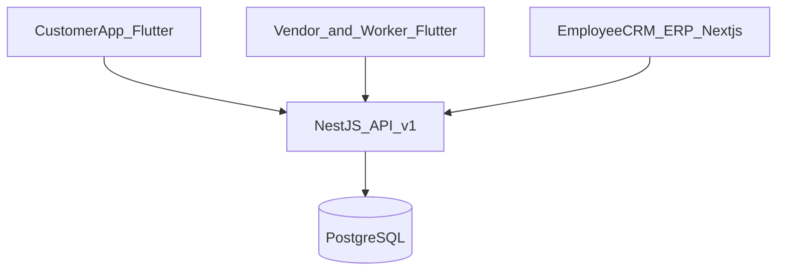
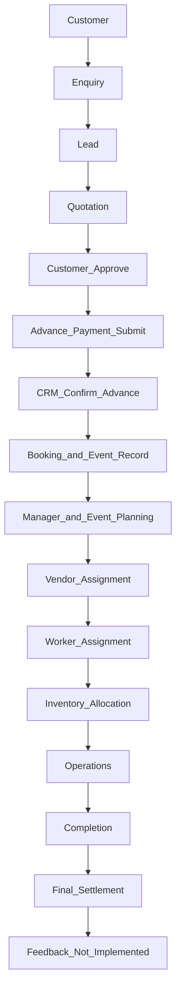

# Mee Events Platform — Engineering Overview

This document is the official engineering introduction to the Mee Events
platform. It is intended for engineers joining the codebase and should be
readable in under fifteen minutes.

Deeper decisions live in [ADRs](../adr/README.md). Product scope lives in the
[Master PRD](../product/prd/00-master-prd-v1.md).

New to software engineering? Start with the
[Mee Events beginner engineering path](./beginner-engineering-path.md), then use
the [interview knowledge base](./interview-knowledge-base.md) to record what you
can explain and defend.

---

## 1. Project Overview

### What is Mee Events?

Mee Events is a connected event operating system. Phase 1 targets Hyderabad
with one NestJS backend, one PostgreSQL source of truth, one Flutter multi-role
mobile application, and one Next.js Employee CRM/ERP portal.

It is not a standalone booking widget. It is a modular business platform that
connects customer-facing journeys to internal sales, fulfilment, operations,
inventory, and finance through a shared **Event Record** aggregate.

### Why was it built?

Event businesses typically run enquiry, quotation, vendor coordination, worker
tasks, warehouse custody, and settlement across disconnected tools. Status is
re-entered by hand. Pricing, vendor visibility, and operational history diverge
between customer and staff systems.

Mee Events was built so a customer enquiry can travel through CRM, booking,
operations, fulfilment, and settlement without re-entry, with PostgreSQL as the
authoritative store and the backend owning authentication, authorization, and
controlled writes ([ADR 0010](../adr/0010-connected-hyderabad-platform-phase-one.md)).

### What business problem does it solve?

| Problem                                 | Platform response                                                           |
| --------------------------------------- | --------------------------------------------------------------------------- |
| Fragmented lead and quote handling      | CRM leads, requirements, and quotations on one API                          |
| Unclear handoff from sale to fulfilment | Advance confirmation creates booking and Event Record together              |
| Disconnected vendors and workers        | Assignment, accept/reject, progress, and attendance on shared event context |
| Inventory and custody gaps              | Warehouse items, allocations, movements, and maintenance                    |
| Finance separated from operations       | Settlements, expenses, invoices, receipts, and ledger against events        |
| Weak audit trail                        | Append-only audit events, timelines, activities, and outbox side effects    |

Operating model: managed marketplace ([ADR 0008](../adr/0008-managed-marketplace-pricing-and-vendor-visibility.md)). Mee Events controls
customer-facing price and vendor visibility; customers engage Mee Events
offerings, not open vendor selection.

---

## 2. Vision

Long term, Mee Events is an AI-powered end-to-end event management platform that
covers the full lifecycle from enquiry through event completion, finance,
inventory, vendors, workers, operations, and analytics.

Near-term engineering scope is **Connected Hyderabad Phase 1**: a single branch
(`HYD`), one mobile binary for customer and field roles, one Employee CRM/ERP,
one versioned REST API, and one PostgreSQL database. AI-assisted planning and
automation are later phases; they are not claimed as shipped capability in this
document.

---

## 3. Platform Architecture

Mee Events exposes three product surfaces on one backend and one database.



Shipped clients are **one Flutter binary** (Customer, Vendor, Worker) and
**one Next.js Employee CRM/ERP**. There is no separate Employee Mobile app
package. Backend bootstrap sends employee, manager, support, finance,
administrator, and auditor roles to `employee_web`. Manager/operations Flutter
screens that remain in `apps/mobile` are not a reachable Employee Mobile
product; Phase 6 `EMP-*` is still **MISSING**. Mobile entry is **AppGateway
only** (Customer, Vendor ops, Worker ops). Development role-preview shells and
the former `apps/customer-web` prototype have been removed. AppGateway must
never impersonate production authorization.

### Customer App

|                   |                                                                                                                                                              |
| ----------------- | ------------------------------------------------------------------------------------------------------------------------------------------------------------ |
| **Purpose**       | Customer discovery, planning, enquiry, quotation decisions, advance payment, and event visibility                                                            |
| **Main users**    | Customers                                                                                                                                                    |
| **Core features** | Catalog browsing; enquiry create/read; quotation approve/reject/request revision; advance payment submit; event record and workspace; customer finance reads |

Path: `apps/mobile` (customer feature area under `lib/features/customer/`).

### ERP Web

|                         |                                                                                                                                                                                                                             |
| ----------------------- | --------------------------------------------------------------------------------------------------------------------------------------------------------------------------------------------------------------------------- |
| **Purpose**             | Employee command centre for CRM sales and ERP fulfilment                                                                                                                                                                    |
| **Departments / areas** | CRM (leads, quotes); ERP (events, operations, manager ops, vendors, workers, warehouse, inventory, finance)                                                                                                                 |
| **Core modules**        | Leads, quotations, bookings (detail), event records, manager assignment and tasks, vendor registry and assignments, worker registry and tasks/attendance, warehouse and inventory, operations execution, finance settlement |

Path: `apps/erp-web` (Next.js App Router under `src/app/`).

### Staff Mobile roles

Vendor and Worker self-service run in the same Flutter binary as the Customer
App. Employee staff work is the Next.js portal (`apps/erp-web`), not a second
Flutter application.

#### Manager (ERP Web, not a shipped mobile product)

|                      |                                                                                                           |
| -------------------- | --------------------------------------------------------------------------------------------------------- |
| **Purpose**          | Event ownership after booking: assignment, tasks, and cross-module coordination                           |
| **Responsibilities** | Manager assignment; task and progress views; entry points into operations, inventory, and finance screens |
| **Client**           | `employee_web`. In-tree Flutter manager screens are not a production Employee Mobile surface              |

#### Vendor

|                      |                                                     |
| -------------------- | --------------------------------------------------- |
| **Purpose**          | Fulfilment partner self-service for assigned work   |
| **Responsibilities** | View assignments; accept or reject; report progress |

#### Worker

|                      |                                                       |
| -------------------- | ----------------------------------------------------- |
| **Purpose**          | Field execution for assigned labour                   |
| **Responsibilities** | View tasks; update progress; attendance-related flows |

Supervisor is not a platform product role. Where “supervisor” appears in
operations contracts, it is an assignee type for tasks, not a separate app
surface.

---

## 4. Technology Stack

### Backend

| Technology            | Role                                                                             |
| --------------------- | -------------------------------------------------------------------------------- |
| NestJS                | Modular monolith API (`apps/backend`)                                            |
| TypeScript            | Primary server language                                                          |
| PostgreSQL            | Transactional source of truth                                                    |
| `pg` + SQL migrations | Persistence and schema evolution                                                 |
| JWT                   | Short-lived access tokens; device-bound refresh sessions                         |
| REST                  | Versioned HTTP API under `/api/v1`                                               |
| Zod / `api-contracts` | Shared request and response contracts                                            |
| Redis                 | Local infrastructure (e.g. rate limits / supporting services via Docker Compose) |

PostgreSQL may be hosted on a managed provider (including Supabase as a host).
Application authentication and authorization remain backend-owned. Supabase Auth
and RLS are not the platform authorization layer.
`docs/references/supabase/schema.sql` is legacy and is not the schema source of
truth ([ADR 0011](../adr/0011-prd-suite-and-flutter-confirmation.md)). Flutter
uses the Nest API as its application data/auth boundary; SEC-06 removed its
direct Supabase initialization, table service, and package. Nest still depends
on `@supabase/supabase-js` for operational asset scripts, not for login or
schema.

### Frontend

| Technology | Role                                  |
| ---------- | ------------------------------------- |
| Next.js    | Employee CRM/ERP (`apps/erp-web`)     |
| Flutter    | Multi-role mobile app (`apps/mobile`) |

### Development

| Technology      | Role                                             |
| --------------- | ------------------------------------------------ |
| pnpm + Corepack | TypeScript workspace package manager             |
| pnpm workspaces | `apps/backend`, `apps/erp-web`, `packages/*`     |
| GitHub Actions  | CI for TypeScript verify path and Flutter checks |
| Docker Compose  | Local PostgreSQL and Redis                       |
| Vitest          | Backend and ERP unit/integration tests           |

Flutter lives in the same repository but outside the pnpm workspace and is
managed with the Flutter SDK. The monorepo does not use Turbo.

---

## 5. Backend Modules

Modules are registered from `apps/backend/src/app.module.ts` unless noted.

| Module                    | Path                          | Responsibility                                                                     |
| ------------------------- | ----------------------------- | ---------------------------------------------------------------------------------- |
| Authentication (Identity) | `modules/identity`            | OTP request/verify, refresh, logout, device sessions                               |
| Platform Foundation       | `modules/platform-foundation` | Authenticated bootstrap (role, branch, modules, capabilities); access-token guard  |
| Authorization             | `modules/authorization`       | Capability guard, `@RequireCapability`, `@Public` (no Nest module; cross-cutting)  |
| Catalog                   | `modules/catalog`             | Event types and service categories                                                 |
| Enquiries                 | `modules/enquiries`           | Customer enquiry create/read; writes `enquiry.submitted` outbox; CRM lead is async |
| CRM                       | `modules/crm`                 | Lead list/detail, claim, requirements                                              |
| Quotations                | `modules/quotations`          | Customer and CRM quotation lifecycle                                               |
| Payments                  | `modules/payments`            | Advance submit and CRM confirm                                                     |
| Bookings                  | `modules/bookings`            | Booking reads after creation on advance confirm                                    |
| Event Records             | `modules/event-records`       | Central Event Record aggregate, status, timeline, activities                       |
| Manager Operations        | `modules/manager-operations`  | Manager assignment, tasks, progress                                                |
| Vendor Management         | `modules/vendors`             | Vendor registry, assignments, vendor self-service                                  |
| Worker Management         | `modules/workers`             | Worker registry, tasks, attendance, worker self-service                            |
| Inventory                 | `modules/inventory`           | Warehouses, items, allocations, movements, maintenance                             |
| Finance                   | `modules/finance`             | Expenses, settlements, payouts, invoices, receipts, ledger                         |
| Operations                | `modules/operations`          | Execution tasks, attendance, issues, materials, progress, completion               |
| Audit                     | `modules/audit`               | Global audit sink for controlled mutations                                         |
| Health                    | `modules/health`              | Liveness and readiness (Postgres probe)                                            |

### Shared libraries

| Library           | Path                                            | Responsibility                                                       |
| ----------------- | ----------------------------------------------- | -------------------------------------------------------------------- |
| API contracts     | `packages/api-contracts`                        | Shared Zod schemas, module and capability catalogs                   |
| Shared types      | `packages/shared-types`                         | Platform roles and identity/session types                            |
| Pattern B writers | `apps/backend/src/common/pattern-b`             | Event- and module-scoped timeline/activity plus audit/outbox helpers |
| Pagination        | `apps/backend/src/common/pagination`            | Shared list pagination helpers                                       |
| Branch context    | `apps/backend/src/common/branch`                | Hyderabad branch resolution                                          |
| HTTP / errors     | `apps/backend/src/common/http`, `common/errors` | Exception filter, validation pipe, domain errors                     |

---

## 6. High-Level Event Flow

Implemented business handoff (simplified):



### Flow notes

1. **Enquiry and lead** are not created in the same write. `POST /enquiries`
   commits the enquiry plus an `enquiry.submitted` outbox row. The CRM
   `EnquirySubmittedOutboxProcessor` creates the lead later (`SEC-04` outbox
   lease/recovery for live processors; other topics remain unconsumed).
   Customers create enquiries; CRM owns lead claim and
   requirements.
2. **Quotation** is produced from a lead. Customers approve, reject, or request
   revision.
3. **Advance payment** is submitted by the customer and confirmed by CRM.
   Confirmation creates the **booking and Event Record** atomically. Booking is
   not created before confirmed advance.
4. **Event planning** is expressed through Event Record status/notes/timeline
   and manager-operations assignment—not a separate planning module.
5. **Vendor, worker, and inventory** assignments attach to the event and are
   operable from ERP and corresponding mobile roles.
6. **Operations** drives execution through to completion.
7. **Final settlement** is owned by the finance module (expenses, vendor
   settlements, worker payouts, documents, ledger). Event-record closure hooks
   after settlement continue to mature.
8. **Feedback** is not implemented. Event upcoming-action stubs still label
   feedback collection as future work.

---

## 7. System Principles

### Modular Architecture

The backend is a NestJS modular monolith ([ADR 0001](../adr/0001-monorepo-and-modular-monolith.md)).
Each domain owns application services, ports, and PostgreSQL adapters.
Boundaries are designed so modules can later be extracted without rewriting
clients.

### Pattern B

Controlled mutations follow a consistency pattern: append timeline and activity
entries (event-anchored and/or module-scoped), and write audit plus outbox
records in the same transactional path. Shared helpers live under
`apps/backend/src/common/pattern-b/`. Module-scoped history tables are defined
in migration `0013_pattern_b_consistency.sql`.

### Security First

Identity uses E.164 mobile login, OTP digests with rate limits, short-lived
access tokens, and rotating refresh tokens bound to device sessions
([ADR 0002](../adr/0002-identity-and-session-security.md)). Secrets are not
committed or embedded in client builds. Clients do not write the database
directly.

### Capability-Based Authorization

Roles map to capabilities. Controllers declare required capabilities via
`@RequireCapability`. `CapabilityGuard` enforces the map server-side. Bootstrap
exposes the effective capability set to authenticated clients.

### API First

The public contract is versioned REST under `/api/v1` with stable,
machine-readable errors ([ADR 0004](../adr/0004-api-contracts-and-versioning.md)).
Shared Zod contracts in `packages/api-contracts` keep TypeScript clients aligned
with the backend.

### Scalable Design

Phase 1 is a single-branch modular monolith with indexed SQL migrations,
pagination helpers, and outbox/idempotency foundation tables. Scale is pursued
through clear module boundaries and database authority, not premature service
decomposition.

### Auditability

Financial and controlled operational changes are append-only. Audit events and
outbox events support reconstruction and reliable side-effect delivery.
Hard deletes are not used for financial or audit history
([ADR 0005](../adr/0005-persistence-boundary.md)).

### Performance

Read paths use repository queries with pagination and indexes introduced via
migrations. Authentication principal caching reduces repeated session resolution
on guarded routes. Verify (`format`, `lint`, `typecheck`, `test`, `build`) is
the quality gate before merge.

### Consistency

PostgreSQL is authoritative. Clients sync from the API; push—if present—only
notifies. Pattern B keeps timeline, activity, audit, and outbox aligned on
writes that change business state.

---

## 8. Repository Structure

```text
apps/
  backend/        NestJS modular monolith (`/api/v1`)
  erp-web/        Next.js Employee CRM/ERP
  mobile/         Flutter multi-role app (outside pnpm workspace)
packages/
  api-contracts/  Shared Zod schemas, modules, capabilities
  shared-types/   Shared identity and role types
infrastructure/
  postgres/       Versioned SQL migrations, apply script, seeds
  docker-compose.yml
docs/
  01-overview/       Engineering overview (this document)
  02-architecture/   System architecture, backend handbook, Pattern B
  03-database/       Schema, migrations, transactions
  04-api/            REST route reference
  05-security/       Authn, authz, JWT, capabilities, secrets
  06-workflows/      Cross-module business flows
  07-deployment/     Local, env, CI, production posture
  08-testing/        Test strategy and verify gate
  adr/               Architecture decision records
  product/           PRD suite
  design-system/     Design system
  references/supabase/  Legacy schema dump (not SoT)
  README.md          Docs index
```

Root package name: `me-event-platform`. TypeScript workspaces are declared in
`pnpm-workspace.yaml` (`apps/backend`, `apps/erp-web`, `packages/*`).

---

## 9. Engineering Standards

| Standard         | Expectation                                                                                                   |
| ---------------- | ------------------------------------------------------------------------------------------------------------- |
| Verify gate      | `corepack pnpm verify` must pass: `format:check` → `lint` → `typecheck` → `test` → `build`                    |
| TypeScript       | Strict mode in TypeScript packages                                                                            |
| Pattern B        | Controlled mutations append timeline/activity and audit/outbox consistently                                   |
| API stability    | No breaking `/api/v1` changes without a new version ([ADR 0004](../adr/0004-api-contracts-and-versioning.md)) |
| Database changes | Migration-first only via `infrastructure/postgres/migrations/` (`corepack pnpm db:migrate`)                   |
| Authorization    | Capability-based checks on controlled endpoints; never rely on client-only gates                              |
| Persistence      | Repository ports and PostgreSQL adapters; database is source of truth                                         |
| ADRs             | Accepted ADRs are the engineering source of truth for architectural decisions                                 |

Flutter changes are validated with Flutter format/analyze/test in CI, in
addition to the TypeScript verify path.

---

## 10. Current Status

| Area                  | Status                                                                                       |
| --------------------- | -------------------------------------------------------------------------------------------- |
| Backend foundation    | Completed — identity, bootstrap, branch, audit, outbox, idempotency                          |
| Domain modules        | Completed foundation — catalogue through finance and operations modules wired in `AppModule` |
| Pattern B             | Completed — shared writers and module timeline/activity migrations                           |
| Security hardening    | Completed foundation — JWT access guard, capability authorization, session model             |
| Performance hardening | Completed foundation — pagination, indexes, principal cache paths                            |
| Database optimization | Completed foundation — versioned migrations through Pattern B and FK indexes                 |
| Tests                 | Foundation and module specs present under `apps/backend/test/`                               |
| `pnpm verify`         | Required green gate for TypeScript workspace changes                                         |
| Current phase         | Engineering documentation                                                                    |

This overview supersedes the high-level status narrative in the root README for
onboarding purposes. For product backlog and slice ordering, see the Master PRD
and [ADR 0010](../adr/0010-connected-hyderabad-platform-phase-one.md).

---

## Related documents

| Document                                                       | Use when                           |
| -------------------------------------------------------------- | ---------------------------------- |
| [ADR index](../adr/README.md)                                  | Architectural decisions            |
| [Master PRD](../product/prd/00-master-prd-v1.md)               | Product scope and lifecycle intent |
| [Local development](../07-deployment/local-development.md)     | Machine setup                      |
| [Postgres migrations](../../infrastructure/postgres/README.md) | Schema change process              |
| [Secrets](../05-security/secrets.md)                           | Secret handling                    |
| [Docs index](../README.md)                                     | Canonical docs map                 |
