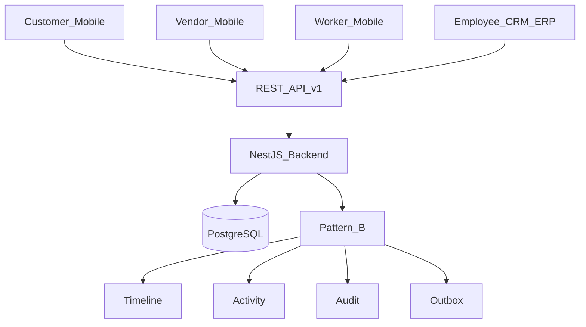
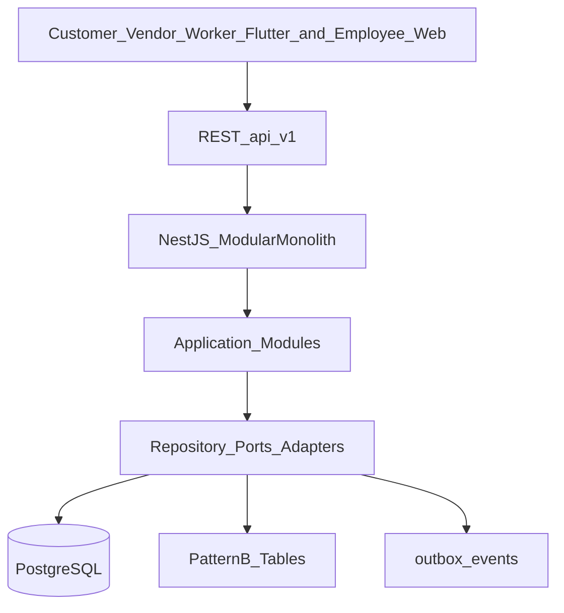
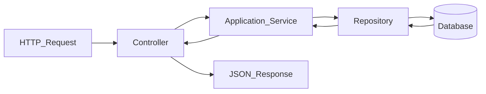
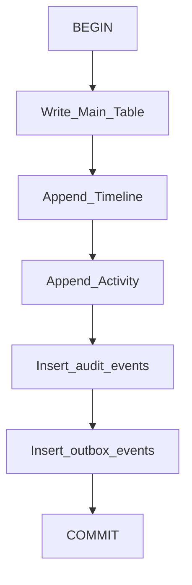
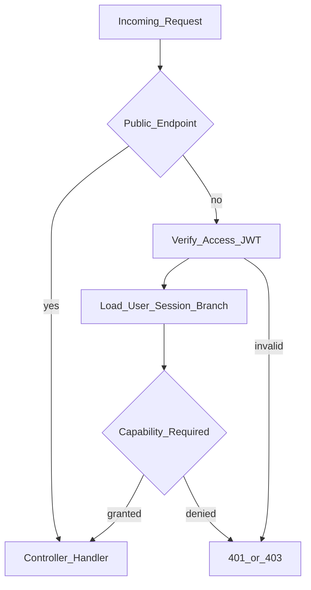
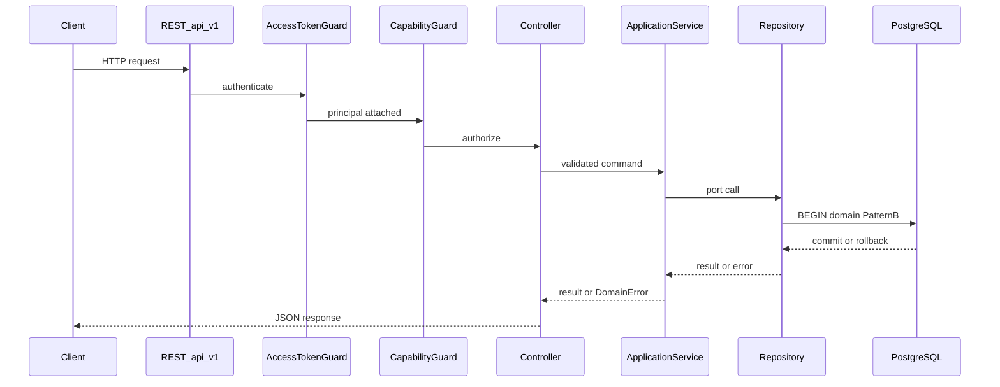

# Mee Events Platform — System Architecture

This is the official System Architecture document for the Mee Events platform.
It describes the architecture as implemented today and is the engineering
reference for backend, ERP, and mobile development.

Audience: senior software engineers. Product surfaces and onboarding context
live in [Engineering Overview](../01-overview/README.md). Decision history lives
in [ADRs](../adr/README.md).

---

## 1. Purpose

This document exists so engineers can understand the complete system shape
before reading source code: how clients reach the API, how NestJS modules are
layered, how PostgreSQL and Pattern B persist state, how security is enforced,
and how a request moves from HTTP entry to committed write and JSON response.

It is intentionally factual. Features, endpoints, and future systems that are
not implemented are not described as present.

---

## 2. System Overview

Mee Events is a connected Hyderabad Phase 1 platform: one NestJS modular
monolith, one PostgreSQL source of truth, one Flutter multi-role mobile
application, and one Next.js Employee CRM/ERP portal. Clients never write the
database directly. The backend authenticates, authorizes, transacts, audits,
and records outbox side effects.



| Layer               | Responsibility                                                                                            |
| ------------------- | --------------------------------------------------------------------------------------------------------- |
| Customer Mobile     | Flutter customer role: catalog, enquiry, quotations, advance payment, event workspace, finance reads      |
| Vendor / Worker     | Same Flutter binary: vendor and worker self-service against `/vendors`, `/workers`, and related APIs      |
| Employee CRM/ERP    | Next.js `employee_web`: leads, quotes, events, operations, vendors, workers, warehouse/inventory, finance |
| REST API            | Versioned HTTP under `/api/v1`; OpenAPI available at `/api/docs`                                          |
| NestJS Backend      | Modular monolith: guards, controllers, application services, repository adapters                          |
| PostgreSQL          | Authoritative transactional store; versioned SQL migrations                                               |
| Pattern B           | On controlled mutations: timeline + activity (+ module-scoped variants) written with the business change  |
| Audit               | Append-only `audit_events` for security and controlled operational actions                                |
| Timeline / Activity | Event-anchored and module-scoped history tables for narrative and operational activity                    |
| Outbox              | `outbox_events` written in the same transaction for reliable asynchronous side-effect delivery            |

Customer, Vendor, and Worker share `apps/mobile`. Employees use `apps/erp-web`.
There is no shipped Employee Mobile app; bootstrap maps employee/manager roles
to `employee_web`. Phase 6 `EMP-*` remains **MISSING**.

---

## 3. High-Level Architecture



### Clients

Four product surfaces call the same API:

- Flutter Customer App
- Flutter Vendor role
- Flutter Worker role
- Next.js Employee CRM/ERP (`employee_web`)

A separate Employee Mobile application is not shipped. Manager Flutter screens
in `apps/mobile` are not a reachable product surface.

### REST API

Global prefix `api`, URI versioning default `1` → `/api/v1/...`. Breaking
contract changes require a new API version ([ADR 0004](../adr/0004-api-contracts-and-versioning.md)).
Shared Zod contracts live in `packages/api-contracts`.

### NestJS modular monolith

Domain modules are registered from the root application module. Cross-cutting
concerns include configuration validation, structured logging (Pino), global
access-token guard, database pool, audit sink, and global exception filter.

### Application modules

Each domain module owns presentation controllers, an application service, a
repository port (Symbol token + interface), and a PostgreSQL adapter.

### Repositories

Adapters execute SQL through a shared `pg` pool. Controlled writes open an
explicit transaction, mutate domain tables, append Pattern B rows, and commit
or roll back.

### PostgreSQL

Source of truth for identity, CRM, fulfilment, operations, inventory, and
finance. Schema evolves only through `infrastructure/postgres/migrations/`.

### Pattern B tables and outbox

Event-anchored timelines/activities, module-scoped timelines/activities, audit
events, and outbox events are part of the write model for controlled mutations.
They are not a separate microservice.

---

## 4. Backend Architecture

### NestJS modular architecture

The backend is a NestJS modular monolith
([ADR 0001](../adr/0001-monorepo-and-modular-monolith.md)). Modules expose clear
boundaries so extraction remains possible later; Phase 1 runs as one deployable
API.

### Layers

| Layer          | Location pattern                              | Role                                                  |
| -------------- | --------------------------------------------- | ----------------------------------------------------- |
| Presentation   | `modules/*/presentation/*.controller.ts`      | HTTP routing, capability guards, Zod validation pipes |
| Application    | `modules/*/application/*.service.ts`          | Use cases, `DomainError`, orchestration               |
| Ports          | `modules/*/ports/*-repository.ts`             | Repository interfaces and DI tokens                   |
| Infrastructure | `modules/*/adapters/postgres-*.repository.ts` | SQL, transactions, Pattern B writers                  |

There is no separate Domain package tree. Domain rules live in application
services and PostgreSQL constraints/checks.

Cross-cutting shared code lives under `apps/backend/src/common/` (Pattern B,
pagination, branch context, HTTP filter/pipe, domain errors) and
`apps/backend/src/database/` (global pool).

### Repository pattern and dependency injection

Each module binds a Symbol token to a Postgres adapter, for example
`VENDOR_REPOSITORY` → `PostgresVendorRepository`. Application services inject
the token, not the concrete class. The database module exposes a global
`PG_POOL`.

### Request flow inside a module



1. Controller receives a validated DTO and authenticated principal.
2. Application service enforces business rules and calls the repository port.
3. Repository runs SQL (often inside `BEGIN` / `COMMIT`).
4. Result maps back through service and controller as JSON.

Representative path: CRM vendor create → `CrmVendorController` →
`VendorService` → `VENDOR_REPOSITORY` → `PostgresVendorRepository`.

---

## 5. Module Architecture

Modules below are registered in the root application module unless noted.
Public API lists **controller prefixes** only (not full route catalogs).

### Authentication (Identity)

|                      |                                                                                                    |
| -------------------- | -------------------------------------------------------------------------------------------------- |
| **Purpose**          | Phone OTP authentication, device sessions, access JWT, refresh rotation, logout                    |
| **Responsibilities** | OTP request/verify; issue and rotate tokens; revoke sessions; persist users and sessions           |
| **Dependencies**     | JWT/Config; audit sink; identity repository; principal cache coordination with platform foundation |
| **Public API**       | `/auth`                                                                                            |

### Platform Foundation

|                      |                                                                                                                     |
| -------------------- | ------------------------------------------------------------------------------------------------------------------- |
| **Purpose**          | Authenticated platform bootstrap and global access-token enforcement                                                |
| **Responsibilities** | `GET /platform/bootstrap` (role, Hyderabad branch, modules, capabilities); `AccessTokenGuard`; auth principal cache |
| **Dependencies**     | Identity repository for session/user resolution                                                                     |
| **Public API**       | `/platform`                                                                                                         |

### Catalog

|                      |                                                          |
| -------------------- | -------------------------------------------------------- |
| **Purpose**          | Reference catalog for event types and service categories |
| **Responsibilities** | List event types; list service categories                |
| **Dependencies**     | Catalog repository (DB)                                  |
| **Public API**       | `/catalog` (public)                                      |

### Enquiries

|                      |                                                                                                                                   |
| -------------------- | --------------------------------------------------------------------------------------------------------------------------------- |
| **Purpose**          | Customer enquiry create and read                                                                                                  |
| **Responsibilities** | Create enquiry and `enquiry.submitted` outbox; list/get own enquiries. CRM lead is created asynchronously by the outbox processor |
| **Dependencies**     | Identity; catalog; enquiry repository                                                                                             |
| **Public API**       | `/enquiries`                                                                                                                      |

### CRM (includes Leads)

Leads are **not** a separate Nest module. Staff lead operations live in CRM.

|                      |                                               |
| -------------------- | --------------------------------------------- |
| **Purpose**          | Branch CRM for leads created from enquiries   |
| **Responsibilities** | List/get leads; claim lead; save requirements |
| **Dependencies**     | Identity; lead repository                     |
| **Public API**       | `/crm` (lead handlers under `/crm/leads`)     |

### Quotations

|                      |                                                                                  |
| -------------------- | -------------------------------------------------------------------------------- |
| **Purpose**          | Quotation lifecycle from lead through customer decision                          |
| **Responsibilities** | CRM create/update/revise/send; customer list/get/approve/reject/request revision |
| **Dependencies**     | Identity; quotation repository (lead context in adapter)                         |
| **Public API**       | `/quotations`, `/crm/quotations`                                                 |

### Bookings

|                      |                                                      |
| -------------------- | ---------------------------------------------------- |
| **Purpose**          | Read bookings after creation on advance confirmation |
| **Responsibilities** | Customer list/get; CRM list/get by branch            |
| **Dependencies**     | Identity; booking repository                         |
| **Public API**       | `/bookings`, `/crm/bookings`                         |

Bookings are created by the payments confirmation path, not by a booking create
endpoint.

### Payments

|                      |                                                                                                        |
| -------------------- | ------------------------------------------------------------------------------------------------------ |
| **Purpose**          | Advance payment submit (customer) and confirm (CRM)                                                    |
| **Responsibilities** | Submit advance; list own payments; CRM confirm (creates booking + event record); CRM list by quotation |
| **Dependencies**     | Identity; payment repository; event-number helper from event-records                                   |
| **Public API**       | `/payments`, `/crm/payments`                                                                           |

### Event Records

|                      |                                                                            |
| -------------------- | -------------------------------------------------------------------------- |
| **Purpose**          | Central Event Record aggregate after booking                               |
| **Responsibilities** | Customer list/get/timeline/activities; CRM status, notes, timeline updates |
| **Dependencies**     | Identity; event-record repository                                          |
| **Public API**       | `/events`, `/crm/events`                                                   |

### Vendor Management

|                      |                                                              |
| -------------------- | ------------------------------------------------------------ |
| **Purpose**          | Vendor registry, event assignments, vendor self-service      |
| **Responsibilities** | CRM vendors/assignments/notes; vendor accept/reject/progress |
| **Dependencies**     | Identity; vendor repository                                  |
| **Public API**       | `/crm/vendors`, `/vendors` (self under `/vendors/me/...`)    |

### Worker Management

|                      |                                                                |
| -------------------- | -------------------------------------------------------------- |
| **Purpose**          | Worker registry, tasks, attendance, worker self-service        |
| **Responsibilities** | CRM workers/tasks/attendance; worker check-in/out and progress |
| **Dependencies**     | Identity; worker repository                                    |
| **Public API**       | `/crm/workers`, `/workers` (self under `/workers/me/...`)      |

### Inventory

|                      |                                                                                               |
| -------------------- | --------------------------------------------------------------------------------------------- |
| **Purpose**          | Warehouses, stock items, allocations, movements, maintenance                                  |
| **Responsibilities** | CRM warehouse and inventory management; assigned staff allocation reads/updates               |
| **Dependencies**     | Identity; inventory repository                                                                |
| **Public API**       | `/crm` (subpaths `warehouses`, `inventory`, …), `/inventory` (self under `/inventory/me/...`) |

### Finance

|                      |                                                                                                                                             |
| -------------------- | ------------------------------------------------------------------------------------------------------------------------------------------- |
| **Purpose**          | Event finance, expenses, settlements, documents, ledger                                                                                     |
| **Responsibilities** | CRM finance dashboard and event finance; payments/refunds/expenses; vendor settlements; worker payouts; invoices/receipts/ledger; own reads |
| **Dependencies**     | Identity; finance repository                                                                                                                |
| **Public API**       | `/crm/finance`, `/finance` (self under `/finance/me/...`)                                                                                   |

### Operations

|                      |                                                                                      |
| -------------------- | ------------------------------------------------------------------------------------ |
| **Purpose**          | Field execution through completion                                                   |
| **Responsibilities** | CRM tasks, attendance, issues, materials, progress, complete; staff self-service ops |
| **Dependencies**     | Identity; operations repository                                                      |
| **Public API**       | `/crm/operations`, `/operations` (self under `/operations/me/...`)                   |

### Manager Operations

|                      |                                                                     |
| -------------------- | ------------------------------------------------------------------- |
| **Purpose**          | Assign event managers and manage manager tasks/progress             |
| **Responsibilities** | CRM assign managers; tasks and progress; assigned-manager dashboard |
| **Dependencies**     | Identity; manager-operations repository                             |
| **Public API**       | `/crm/manager`, `/manager`                                          |

### Authorization (cross-cutting)

|                      |                                                                    |
| -------------------- | ------------------------------------------------------------------ |
| **Purpose**          | Shared authorization decorators and guards                         |
| **Responsibilities** | `@Public`; `@RequireCapability` + `CapabilityGuard`; roles helpers |
| **Dependencies**     | Platform foundation principal and `ROLE_CAPABILITIES`              |
| **Public API**       | None (no HTTP controller; no Nest module registration)             |

### Audit

|                      |                                                                |
| -------------------- | -------------------------------------------------------------- |
| **Purpose**          | Global append-only audit sink                                  |
| **Responsibilities** | Persist `audit_events`; used by identity and Pattern B writers |
| **Dependencies**     | Database                                                       |
| **Public API**       | None                                                           |

### Health

|                      |                                          |
| -------------------- | ---------------------------------------- |
| **Purpose**          | Process and dependency probes            |
| **Responsibilities** | Liveness; readiness with PostgreSQL ping |
| **Dependencies**     | Database pool                            |
| **Public API**       | `/health` (public)                       |

---

## 6. Pattern B Architecture

### Why Pattern B exists

Controlled mutations must leave a reconstructable history and a durable record
of side effects without relying on ad-hoc logging. Pattern B standardizes four
companion writes around the main domain change: timeline, activity, audit, and
outbox.

### Components

| Component  | Role                                                                         |
| ---------- | ---------------------------------------------------------------------------- |
| Main table | Domain entity being created or updated (vendor, event record, payment, etc.) |
| Timeline   | Ordered narrative entries (event-anchored or module-scoped)                  |
| Activity   | Structured activity entries for operational/UI feeds                         |
| Audit      | Append-only `audit_events` for security and controlled actions               |
| Outbox     | `outbox_events` for asynchronous notification/integration delivery           |

Event-anchored tables: `event_timelines`, `event_activities`.

Module-scoped tables (migration `0013_pattern_b_consistency.sql`):

| Module     | Timeline               | Activity                |
| ---------- | ---------------------- | ----------------------- |
| Vendor     | `vendor_timelines`     | `vendor_activities`     |
| Worker     | `worker_timelines`     | `worker_activities`     |
| Inventory  | `inventory_timelines`  | `inventory_activities`  |
| Finance    | `finance_timelines`    | `finance_activities`    |
| Operations | `operations_timelines` | `operations_activities` |

Shared helpers:

- Event path: append event timeline + activity; write audit + outbox
- Module path: append module timeline + activity for vendor/worker/inventory/finance/operations

### Dual writes

Pattern B is **not** a separate distributed transaction. Repository adapters
open a SQL transaction, perform the domain write, call Pattern B helpers on the
same client, then commit. Failure at any step rolls back the entire unit.



Relative order of audit versus module timeline may vary by adapter, but all
writes share one transaction boundary.

### Consistency model

| Concern                              | Model                                                                   |
| ------------------------------------ | ----------------------------------------------------------------------- |
| Business state + Pattern B rows      | Strong consistency inside one PostgreSQL transaction                    |
| Outbox delivery to external channels | Eventually consistent after commit (publisher consumes `outbox_events`) |
| Client views                         | Database authoritative; clients sync through the API                    |

Pattern B exists for auditability and reliable side-effect recording, not to
make the primary domain write eventually consistent.

---

## 7. Security Architecture

### Authentication

| Mechanism     | Behavior                                                                   |
| ------------- | -------------------------------------------------------------------------- |
| OTP           | E.164 mobile challenge; HMAC digest stored; verify consumes challenge      |
| Access JWT    | Short-lived bearer token (claims include subject, session, role)           |
| Refresh token | Opaque, rotating, bound to device session; reuse detection revokes session |
| Logout        | Authenticated revocation of the current device session                     |

Details: [Identity foundation](../05-security/identity-foundation.md),
[ADR 0002](../adr/0002-identity-and-session-security.md).

### Guards and public access

| Component          | Role                                                                                                                              |
| ------------------ | --------------------------------------------------------------------------------------------------------------------------------- |
| `AccessTokenGuard` | Global `APP_GUARD`. Skips when `@Public()`. Otherwise verifies JWT, loads user/session, attaches principal (including `branchId`) |
| `CapabilityGuard`  | Applied on controllers after authentication. Requires `@RequireCapability` and checks `ROLE_CAPABILITIES[activeRole]`             |
| `@Public`          | Opt-out of access-token authentication                                                                                            |

Public endpoints today:

| Prefix / routes                               | Module   |
| --------------------------------------------- | -------- |
| `/health/live`, `/health/ready`               | Health   |
| `/auth` OTP request, OTP verify, refresh      | Identity |
| `/catalog` event-types and service-categories | Catalog  |

Bootstrap (`/platform`) is authenticated.

### Capability model

Capabilities are string identifiers (for example enquiry create-own, CRM lead
read, finance settlement). Roles map to capability sets in platform foundation
domain policy. Controllers declare the capability required for each action.
Clients receive the effective set from bootstrap; enforcement is always
server-side.

### Branch context

Phase 1 is Hyderabad-only. `resolveBranchId` sets branch on the principal from
role scope when present, otherwise the seeded Hyderabad branch. Branch remains
in the model for later multi-branch expansion ([ADR 0010](../adr/0010-connected-hyderabad-platform-phase-one.md)).

### Authorization request flow



---

## 8. Request Lifecycle

End-to-end path for a typical authenticated mutating request:

```text
Client → REST /api/v1 → AccessTokenGuard → CapabilityGuard
  → ZodValidationPipe → Controller → Application Service
  → Repository → Transaction (+ Pattern B) → Commit → JSON Response
```

Failures enter `GlobalExceptionFilter` and return a stable error envelope.



---

## 9. Error Handling

| Class                      | Source                                   | Handling                                       |
| -------------------------- | ---------------------------------------- | ---------------------------------------------- |
| Validation errors          | `ZodValidationPipe` on controller params | Nest `BadRequestException`                     |
| AuthN / AuthZ failures     | Guards                                   | `UnauthorizedException` / `ForbiddenException` |
| Business rule failures     | Application services                     | `DomainError(code, message, status)`           |
| Unexpected errors          | Any layer                                | Mapped to `INTERNAL_ERROR`                     |
| Repository failures mid-TX | Adapters                                 | `ROLLBACK`, then rethrow                       |

`GlobalExceptionFilter` response shape:

| Field       | Meaning                                                                                |
| ----------- | -------------------------------------------------------------------------------------- |
| `code`      | Machine-readable code (`DomainError.code`, `HTTP_REQUEST_FAILED`, or `INTERNAL_ERROR`) |
| `message`   | Safe client message (5xx messages sanitized for non-domain errors)                     |
| `status`    | HTTP status                                                                            |
| `requestId` | From `x-request-id` or generated UUID                                                  |

Transaction rollback ensures failed controlled mutations do not leave partial
Pattern B or domain rows.

---

## 10. Database Interaction

### Repositories and pool

A global `pg.Pool` (`PG_POOL`) is provided by the database module. Adapters
borrow clients for queries and transactions.

### Transactions

Mutating repository methods commonly:

1. `BEGIN`
2. Domain inserts/updates (often with `SELECT … FOR UPDATE` on contended rows)
3. Pattern B helper calls on the same client
4. `COMMIT` or `ROLLBACK` in `catch`

There is no cross-module distributed transaction manager. Multi-aggregate
atomicity is implemented inside a single adapter transaction when required
(example: enquiry + lead create; advance confirm + booking + event record).

### Concurrency

Many tables carry a `version` column that adapters increment on update.
Contended paths use row locks (`FOR UPDATE`). Compare-and-set rejection on
stale `version` predicates is not the general application pattern today; do not
assume CAS semantics unless a specific query implements them.

### Integrity and reads

| Concern        | Mechanism                                                               |
| -------------- | ----------------------------------------------------------------------- |
| Foreign keys   | Declared in SQL migrations                                              |
| Indexes        | Added via migrations (including FK/supporting indexes)                  |
| Pagination     | Shared helpers: parse page/limit, `LIMIT`/`OFFSET`, pagination metadata |
| Schema changes | Migration-first only (`corepack pnpm db:migrate`)                       |
| Pattern B      | Written inside the same transaction as the domain mutation              |

---

## 11. Scalability

Current scalability goals target Connected Hyderabad Phase 1—not unbounded
global scale.

| Lever                    | How it helps today                                                                                                                       |
| ------------------------ | ---------------------------------------------------------------------------------------------------------------------------------------- |
| Stateless backend        | Nest processes hold no authoritative session store beyond DB-backed device sessions; horizontal scale is feasible behind a load balancer |
| REST API                 | Simple client integration; versioned contracts limit blast radius of change                                                              |
| Pagination               | Bounds list payloads for CRM and mobile feeds                                                                                            |
| Optimized indexes        | Migration-driven indexes support list/filter paths                                                                                       |
| Capability authorization | Cheap server-side checks after authentication; avoids client-trusted authorization                                                       |
| Pattern B                | Keeps history local to PostgreSQL transactions; avoids cross-service dual-write protocols in Phase 1                                     |
| Module isolation         | Clear ports/adapters reduce coupling inside the monolith                                                                                 |

Non-goals for this phase: claiming infinite scalability, premature microservice
decomposition, or multi-region active-active.

---

## 12. Engineering Principles

### Modularity

Domain modules own their HTTP surface, application logic, and persistence
adapter. Shared kernels stay small (`common/`, contracts packages).

### Single Responsibility

Controllers translate HTTP. Services enforce use cases. Repositories persist.
Guards authenticate and authorize. Filters normalize errors.

### Consistency

PostgreSQL is authoritative. Controlled writes commit domain state and Pattern B
companions together.

### Security First

Backend-owned authn/authz, hashed OTP/refresh digests, short-lived access
tokens, append-only audit, no direct client database access.

### API First

`/api/v1` plus shared Zod contracts are the integration boundary for ERP and
mobile.

### Database Integrity

Migrations, foreign keys, check constraints, and transactional writes protect
invariants.

### Performance

Pagination, indexes, principal caching on guarded routes, and bounded list
queries. Quality gate: `corepack pnpm verify`.

### Observability

Pino HTTP logging with redaction, request IDs, health probes. Audit and outbox
support operational reconstruction.

### Maintainability

Strict TypeScript, repository ports, ADRs for decisions, and documentation that
tracks implemented reality.

---

## 13. Repository Structure

```text
apps/
  backend/         NestJS modular monolith and /api/v1
  erp-web/         Next.js Employee CRM/ERP
  mobile/          Flutter multi-role client (outside pnpm workspace)
packages/
  api-contracts/   Shared Zod schemas, modules, capabilities
  shared-types/    Shared identity and role types
infrastructure/
  postgres/        Versioned migrations, apply script, seeds
  docker-compose.yml
docs/
  01-overview/     Platform engineering overview
  02-architecture/ System architecture (this document)
  03-database/     Schema and migrations
  04-api/          REST route reference
  05-security/     Authn, authz, secrets, identity notes
  06-workflows/    Cross-module business flows
  07-deployment/   Local, env, CI, production posture
  08-testing/      Test strategy and verify gate
  adr/             Architecture decision records
  product/         PRD suite
  design-system/   Design system
  references/supabase/  Legacy schema dump (not SoT)
  README.md        Docs index
```

TypeScript workspaces: `apps/backend`, `apps/erp-web`, `packages/*`. Flutter is
first-class in the repository but managed with the Flutter SDK, not pnpm.

---

## 14. Future Architecture

Only items already acknowledged in project docs:

| Item                          | Notes                                                                                                                                                                                                          |
| ----------------------------- | -------------------------------------------------------------------------------------------------------------------------------------------------------------------------------------------------------------- |
| Flutter UI maturation         | Vendor and Worker (and related) visual designs continue to mature against existing APIs; Flutter itself is already the confirmed mobile client ([ADR 0011](../adr/0011-prd-suite-and-flutter-confirmation.md)) |
| Additional UI coverage        | More ERP and mobile screens may bind to APIs that already exist                                                                                                                                                |
| Identity production hardening | Approved SMS provider; Redis-backed rate limits across replicas; mobile change/recovery workflows ([identity foundation](../05-security/identity-foundation.md))                                               |
| Later module extraction       | Modular monolith boundaries exist so services can be extracted later if needed ([ADR 0001](../adr/0001-monorepo-and-modular-monolith.md))                                                                      |

This section does not define AI architecture or invent new platform services.

---

## 15. Architecture Decision Summary

| Decision                       | Rationale                                                                                                                                                                                                      |
| ------------------------------ | -------------------------------------------------------------------------------------------------------------------------------------------------------------------------------------------------------------- |
| NestJS modular monolith        | Fast modular delivery with DI, guards, and clear module boundaries; extraction path retained ([ADR 0001](../adr/0001-monorepo-and-modular-monolith.md))                                                        |
| PostgreSQL                     | Transactional source of truth for financial and operational invariants; SQL migrations + `pg` ([ADR 0005](../adr/0005-persistence-boundary.md), [ADR 0011](../adr/0011-prd-suite-and-flutter-confirmation.md)) |
| Repository pattern             | Keeps application services independent of SQL details; adapters own transactions and Pattern B                                                                                                                 |
| Pattern B                      | Guarantees timeline, activity, audit, and outbox companions on controlled mutations inside one transaction                                                                                                     |
| Capability-based authorization | Role → capability map enforced server-side; finer than role checks alone; bootstrap exposes effective capabilities                                                                                             |
| pnpm workspaces                | Shared TypeScript packages (`api-contracts`, `shared-types`) and apps with one verify gate; Flutter remains a first-class sibling app                                                                          |

---

## Related documents

| Document                                                       | Role                                        |
| -------------------------------------------------------------- | ------------------------------------------- |
| [Engineering Overview](../01-overview/README.md)               | Platform intro, surfaces, lifecycle, status |
| [ADR index](../adr/README.md)                                  | Decision records                            |
| [Identity foundation](../05-security/identity-foundation.md)   | OTP/session domain notes                    |
| [Postgres migrations](../../infrastructure/postgres/README.md) | Schema change process                       |
| [Master PRD](../product/prd/00-master-prd-v1.md)               | Product scope                               |
