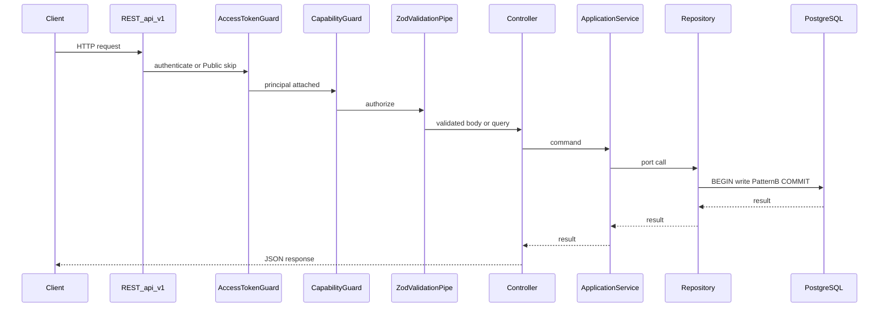
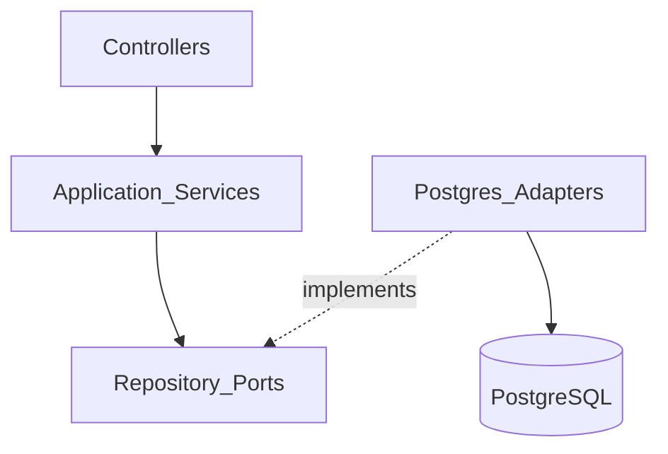

# Mee Events Platform — Backend Engineering Handbook

This is the official Backend Engineering Guide for Mee Events. It explains how
the NestJS backend is implemented today and how new modules should be developed.

Audience: backend engineers joining the project.

System-wide architecture lives in
[architecture.md](./architecture.md). Product surfaces and onboarding live in
[Engineering Overview](../01-overview/README.md).

---

## 1. Backend Overview

The backend is a NestJS modular monolith under `apps/backend`. It exposes a
versioned REST API (`/api/v1`), owns authentication and authorization, and
persists through PostgreSQL via repository adapters.

| Decision                 | Why                                                                                                                                                                                                                       |
| ------------------------ | ------------------------------------------------------------------------------------------------------------------------------------------------------------------------------------------------------------------------- |
| **NestJS**               | Structured DI, guards, modules, and HTTP lifecycle for a multi-domain API ([ADR 0001](../adr/0001-monorepo-and-modular-monolith.md))                                                                                      |
| **Modular architecture** | Each domain owns presentation, application, ports, and adapters so boundaries stay clear and extraction remains possible later                                                                                            |
| **Repository pattern**   | Application services depend on ports (interfaces + Symbol tokens); SQL and transactions stay in Postgres adapters                                                                                                         |
| **PostgreSQL**           | Transactional source of truth for financial and operational invariants; schema via SQL migrations + `pg` ([ADR 0005](../adr/0005-persistence-boundary.md), [ADR 0011](../adr/0011-prd-suite-and-flutter-confirmation.md)) |

Reference module for copy-paste structure: **vendors**
(`apps/backend/src/modules/vendors/`).

---

## 2. Request Lifecycle

Typical authenticated mutating request:

```text
HTTP Request
  → AccessTokenGuard (global)
  → CapabilityGuard (controller)
  → ZodValidationPipe (param)
  → Controller
  → Application Service
  → Repository (port → Postgres adapter)
  → Database transaction (+ Pattern B)
  → Repository
  → Application Service
  → Controller
  → JSON Response
```

Failures are normalized by `GlobalExceptionFilter`.



Example path: `POST /api/v1/crm/vendors` → `CrmVendorController` →
`VendorService` → `VENDOR_REPOSITORY` → `PostgresVendorRepository`.

---

## 3. Folder Structure

| Path                             | Purpose                                                                                             |
| -------------------------------- | --------------------------------------------------------------------------------------------------- |
| `apps/backend/src/modules/`      | Domain Nest modules (identity, CRM, vendors, finance, …)                                            |
| `apps/backend/src/common/`       | Shared Pattern B writers, pagination, branch context, HTTP filter/pipe, `DomainError`               |
| `apps/backend/src/config/`       | Startup-validated environment                                                                       |
| `apps/backend/src/database/`     | Global `PG_POOL` (`pg.Pool`)                                                                        |
| `apps/backend/src/main.ts`       | Bootstrap: prefix `api`, URI version `1`, global exception filter, Helmet/CORS, conditional Swagger |
| `apps/backend/src/app.module.ts` | Root module imports and global `AccessTokenGuard`                                                   |
| `packages/api-contracts/`        | Shared Zod request/response schemas, module and capability catalogs                                 |
| `packages/shared-types/`         | Shared identity and role types                                                                      |
| `infrastructure/postgres/`       | Versioned SQL migrations, apply script, seeds                                                       |
| `apps/backend/test/`             | Backend specs and foundation tests                                                                  |

Flutter and ERP clients consume this API; they do not own backend folders.

---

## 4. Module Structure Standard

### Required layout

Modern domain modules follow this layout (vendors, workers, inventory, finance,
operations, manager-operations, and peers):

```text
apps/backend/src/modules/<name>/
  <name>.module.ts
  presentation/                 # HTTP controllers
  application/                  # application services and helpers
  ports/                        # repository interface + Symbol token
  adapters/                     # postgres-*.repository.ts
```

Example — vendors:

```text
modules/vendors/
  vendors.module.ts
  presentation/
    crm-vendor.controller.ts
    vendor.controller.ts
  application/
    vendor.service.ts
    vendor-code.ts
    notification-intents.ts
  ports/
    vendor-repository.ts        # VENDOR_REPOSITORY + VendorRepository
  adapters/
    postgres-vendor.repository.ts
```

### Name mapping (outline → this repo)

| Common name              | Mee Events location                                                                                                                                                              |
| ------------------------ | -------------------------------------------------------------------------------------------------------------------------------------------------------------------------------- |
| Controllers              | `presentation/*.controller.ts`                                                                                                                                                   |
| Services                 | `application/*.service.ts`                                                                                                                                                       |
| Repositories (interface) | `ports/*-repository.ts`                                                                                                                                                          |
| Repositories (SQL)       | `adapters/postgres-*.repository.ts`                                                                                                                                              |
| DTOs                     | Zod schemas in `packages/api-contracts` (not a module-local `dto/` folder)                                                                                                       |
| Infrastructure           | `adapters/` (Postgres)                                                                                                                                                           |
| Domain package           | Optional `domain/` for pure helpers only where already used (identity phone/user; platform-foundation policy). Most modules keep rules in application services + SQL constraints |

Wire the Nest module: import `IdentityModule` when needed, register controllers,
provide the service, guards, and `{ provide: TOKEN, useClass: PostgresAdapter }`.

---

## 5. Repository Pattern

### Responsibilities

| Layer                    | Owns                                                                           | Does not own                                        |
| ------------------------ | ------------------------------------------------------------------------------ | --------------------------------------------------- |
| **Controllers**          | HTTP routes, `@RequireCapability`, Zod pipes, mapping principal → service args | SQL, transactions, business rules beyond HTTP shape |
| **Application services** | Use-case orchestration, `DomainError`, calling ports                           | Raw SQL, Nest HTTP decorators                       |
| **Repository ports**     | Interface and DI token                                                         | Implementation details                              |
| **Repository adapters**  | SQL, `BEGIN`/`COMMIT`/`ROLLBACK`, Pattern B helpers, row mapping               | HTTP status codes, capability checks                |
| **Guards**               | Authentication and capability authorization                                    | Domain mutations                                    |

### Dependency rules



- Controllers depend on application services only.
- Services depend on ports (Symbol injection), never on `Postgres*` classes.
- Adapters implement ports and inject `PG_POOL`.
- Do not import adapters from controllers.
- Do not embed SQL in services.

---

## 6. Transactions

### When transactions start

Mutating adapter methods open a transaction at the start of the unit of work
(typically after borrowing a client from `PG_POOL`).

### Commit and rollback

| Step      | Behavior                                                                 |
| --------- | ------------------------------------------------------------------------ |
| Start     | `BEGIN`                                                                  |
| Work      | Domain inserts/updates; optional `SELECT … FOR UPDATE` on contended rows |
| Pattern B | Timeline/activity and audit/outbox helpers on the **same** client        |
| Success   | `COMMIT`                                                                 |
| Failure   | `catch` → `ROLLBACK` → rethrow                                           |

### Pattern B writes

Controlled mutations append history and side-effect records inside the same
transaction via helpers under `apps/backend/src/common/pattern-b/`:

- Event-anchored timeline/activity + `writeAuditOutbox`
- Module-scoped timeline/activity for vendor, worker, inventory, finance,
  operations

### Consistency guarantees

| Concern                                  | Guarantee                                          |
| ---------------------------------------- | -------------------------------------------------- |
| Domain row + Pattern B companions        | Atomic with the SQL transaction                    |
| Outbox **delivery** to external channels | After commit (eventually delivered by a publisher) |
| Partial failure mid-write                | Rolled back; clients see an error envelope         |

Do not write audit/outbox in a separate connection after commit if the mutation
is meant to be Pattern B–consistent.

---

## 7. Validation

This backend does **not** use Nest `ValidationPipe` or `class-validator`.

### Layers

| Layer           | Mechanism                                                                           | Example                                     |
| --------------- | ----------------------------------------------------------------------------------- | ------------------------------------------- |
| **Wire (DTO)**  | Zod schema in `@me-event/api-contracts` + `ZodValidationPipe` on `@Body` / `@Query` | `new ZodValidationPipe(createVendorSchema)` |
| **Business**    | Application service checks; throw `DomainError(code, message, status)`              | Invalid state transitions, ownership rules  |
| **Persistence** | SQL `NOT NULL`, FK, `CHECK`, unique constraints; adapter errors roll back the TX    | Invalid FK on insert                        |

### Practice

1. Add or extend Zod schemas in `packages/api-contracts`.
2. Import the schema into the controller and attach `ZodValidationPipe`.
3. Keep business invariants in the service even when the schema is valid.
4. Rely on migrations for hard data integrity; do not bypass them in adapters.

---

## 8. Authorization

| Mechanism             | Role                                                                                                     |
| --------------------- | -------------------------------------------------------------------------------------------------------- |
| **JWT access token**  | Short-lived bearer; verified by global `AccessTokenGuard`                                                |
| **Refresh token**     | Opaque, rotating, device-session bound (`/auth/refresh`, public)                                         |
| **OTP**               | E.164 challenge/verify (`/auth/otp/*`, public)                                                           |
| **CapabilityGuard**   | Controller-level; requires `@RequireCapability(...)` after auth                                          |
| **`@Public`**         | Skips access-token auth for selected routes                                                              |
| **Branch context**    | `resolveBranchId` on principal (Hyderabad Phase 1 default)                                               |
| **Role capabilities** | `ROLE_CAPABILITIES` in platform-foundation domain policy; capability IDs also cataloged in api-contracts |

### Public endpoints (today)

- `/health/live`, `/health/ready`
- `/auth` OTP request, OTP verify, refresh
- `/catalog` event-types and service-categories

### Adding a capability

1. Add the capability id to the shared catalog (`api-contracts` / platform
   foundation capability list — keep them aligned).
2. Grant it on the appropriate roles in `ROLE_CAPABILITIES`.
3. Annotate the controller handler with `@RequireCapability(...)`.
4. Ensure the controller uses `CapabilityGuard`.

Clients may read capabilities from `GET /api/v1/platform/bootstrap`. Enforcement
is always server-side.

---

## 9. Error Handling

| Kind              | Source              | Result                                                                    |
| ----------------- | ------------------- | ------------------------------------------------------------------------- |
| Validation errors | `ZodValidationPipe` | `BadRequestException` → filter maps to `HTTP_REQUEST_FAILED`              |
| AuthN / AuthZ     | Guards              | `UnauthorizedException` / `ForbiddenException`                            |
| Business errors   | Services            | `DomainError` with stable `code` and HTTP `status`                        |
| Database errors   | Adapters            | `ROLLBACK`, then rethrow (often wrapped or surfaced as 500/`DomainError`) |
| Unexpected        | Any                 | `INTERNAL_ERROR` via filter                                               |

### Global exception handling

`GlobalExceptionFilter` returns:

| Field       | Meaning                          |
| ----------- | -------------------------------- |
| `code`      | Machine-readable code            |
| `message`   | Client-safe message              |
| `status`    | HTTP status                      |
| `requestId` | From `x-request-id` or generated |

Prefer `DomainError` for expected business failures so clients can branch on
`code`.

---

## 10. Logging and Audit

| Mechanism                         | Purpose                                                               |
| --------------------------------- | --------------------------------------------------------------------- |
| **Pino HTTP logs**                | Request logging with redaction of secrets (authorization, OTP bodies) |
| **Audit events** (`audit_events`) | Append-only security and controlled-action record                     |
| **Timelines**                     | Ordered narrative (event-anchored or module-scoped)                   |
| **Activities**                    | Structured activity feed entries for clients/ERP                      |
| **Outbox** (`outbox_events`)      | Durable intent for async notifications/integrations                   |

Pattern B coordinates timeline, activity, audit, and outbox with the domain
write. See [architecture.md § Pattern B](./architecture.md) for the write path
diagram.

Do not log OTPs, access tokens, or refresh tokens in plaintext.

---

## 11. Performance Guidelines

| Guideline                 | Practice                                                                                                           |
| ------------------------- | ------------------------------------------------------------------------------------------------------------------ |
| **Pagination**            | Use shared helpers in `common/pagination` (`parsePagination`, limit/offset, metadata). Bound every list endpoint.  |
| **Indexes**               | Add supporting indexes in SQL migrations (including FK indexes when needed).                                       |
| **Avoid N+1**             | Load related rows with joins or batched queries inside one repository method. Do not query-per-item from services. |
| **Batch queries**         | Prefer one round-trip for list+count or related collections when the use case needs both.                          |
| **Transactions**          | Keep TX scope to one use case; avoid long interactive work inside `BEGIN`.                                         |
| **Repository guidelines** | Push filtering/sorting into SQL; map rows once; reuse Pattern B helpers instead of duplicating inserts.            |

---

## 12. Coding Standards

| Kind                | Convention                                          | Example                                            |
| ------------------- | --------------------------------------------------- | -------------------------------------------------- |
| Module folder       | kebab-case                                          | `manager-operations`                               |
| Nest module file    | `<plural-or-name>.module.ts`                        | `vendors.module.ts`                                |
| Controller file     | `<role?>-<entity>.controller.ts` in `presentation/` | `crm-vendor.controller.ts`, `vendor.controller.ts` |
| Application service | `<entity>.service.ts`                               | `vendor.service.ts`                                |
| Port file           | `<entity>-repository.ts`                            | `vendor-repository.ts`                             |
| Port token          | `UPPER_SNAKE` Symbol                                | `VENDOR_REPOSITORY`                                |
| Adapter             | `postgres-<entity>.repository.ts`                   | `postgres-vendor.repository.ts`                    |
| Zod schemas         | descriptive camelCase in api-contracts              | `createOperationsTaskSchema`                       |
| Capability ids      | dotted snake-style strings                          | `crm_lead.read`, `enquiry.create_own`              |
| Migrations          | `NNNN_snake_description.sql`                        | `0013_pattern_b_consistency.sql`                   |
| Tests               | `*.spec.ts` under `apps/backend/test/`              | `vendor-management-foundation.spec.ts`             |

Prefer TypeScript `readonly` on DTOs and port inputs. Keep controllers thin.

---

## 13. Adding a New Module

Use **vendors** as the template. Checklist:

1. **Database migration**  
   Add `infrastructure/postgres/migrations/NNNN_<feature>.sql`. Apply with
   `corepack pnpm db:migrate`. Include FKs, checks, indexes, and any module
   timeline/activity tables if Pattern B module scope is required.

2. **Repository port**  
   Create `ports/<entity>-repository.ts` with `SYMBOL` token, mutation context
   type, and interface methods.

3. **Postgres adapter**  
   Implement `adapters/postgres-<entity>.repository.ts`. For controlled
   mutations: transaction + Pattern B helpers + audit/outbox.

4. **Application service**  
   Create `application/<entity>.service.ts`. Inject the port token. Throw
   `DomainError` for business failures.

5. **Controllers**  
   Add CRM and/or self-service controllers under `presentation/`. Apply
   `CapabilityGuard` and `@RequireCapability`. Validate with
   `ZodValidationPipe`.

6. **DTO / contracts**  
   Add Zod schemas and response types to `packages/api-contracts`.

7. **Capabilities**  
   Extend capability catalog and `ROLE_CAPABILITIES`. Decorate handlers.

8. **Pattern B**  
   For controlled writes, call event and/or module Pattern B helpers inside the
   same TX as the domain change.

9. **Nest registration**  
   Create `<name>.module.ts` and import it from `app.module.ts`.

10. **Tests**  
    Add foundation or module specs under `apps/backend/test/`. Cover authz
    denial, happy path, and rollback/Pattern B expectations where relevant.

11. **Documentation**  
    Update architecture/overview module lists if the public surface changes.

---

## 14. Backend Checklist

Before merging backend changes, verify:

| Check         | Expectation                                                                             |
| ------------- | --------------------------------------------------------------------------------------- |
| Tests         | New/updated specs pass                                                                  |
| `pnpm verify` | `corepack pnpm verify` is green (format, lint, typecheck, test, build)                  |
| Pattern B     | Controlled mutations write timeline/activity and audit/outbox in the same TX            |
| Capabilities  | New endpoints declare and enforce `@RequireCapability` (or are intentionally `@Public`) |
| Transactions  | Mutating adapters commit or roll back cleanly; no partial Pattern B rows                |
| Validation    | Zod schemas in api-contracts + `ZodValidationPipe`; business rules in services          |
| Documentation | Handbook/architecture/overview updated when modules or contracts change                 |

---

## Related documents

| Document                                                       | Use when                                             |
| -------------------------------------------------------------- | ---------------------------------------------------- |
| [System Architecture](./architecture.md)                       | Layers, Pattern B, security, request lifecycle depth |
| [Engineering Overview](../01-overview/README.md)               | Platform surfaces and status                         |
| [Identity foundation](../05-security/identity-foundation.md)   | OTP and session domain notes                         |
| [Postgres migrations](../../infrastructure/postgres/README.md) | Applying schema changes                              |
| [ADR 0001](../adr/0001-monorepo-and-modular-monolith.md)       | Modular monolith                                     |
| [ADR 0002](../adr/0002-identity-and-session-security.md)       | Identity and sessions                                |
| [ADR 0004](../adr/0004-api-contracts-and-versioning.md)        | API versioning                                       |
