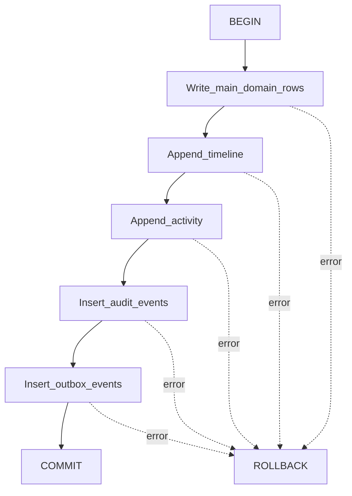
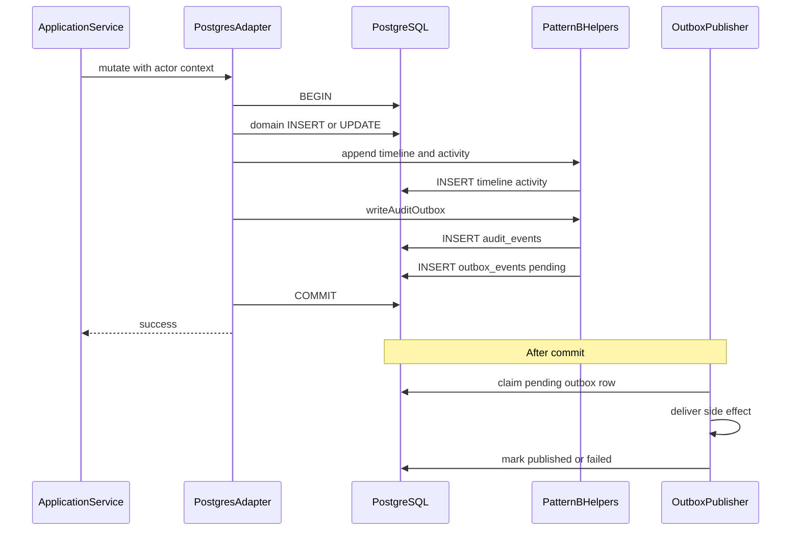
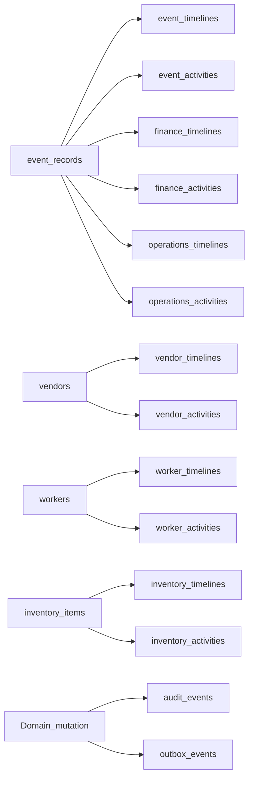

# Mee Events Platform — Pattern B Specification

This is the official engineering specification for **Pattern B**.

It explains why Pattern B exists, how it works, which tables participate,
transaction boundaries, dual writes, and consistency guarantees. A backend
engineer should be able to implement Pattern B for a new module from this
document alone.

Related reading:

- [System Architecture § Pattern B](./architecture.md)
- [Backend Engineering Handbook § Transactions](./backend.md)
- Helpers: `apps/backend/src/common/pattern-b/`
- Schema: migrations `0001` (audit/outbox), `0005` (event timeline/activity),
  `0012` / `0013` (module Pattern B tables)

---

## 1. Introduction

Pattern B is the Mee Events standard for **controlled mutations**: whenever
business state changes in a way that must be auditable and observable, the
repository writes companion records in the **same PostgreSQL transaction** as
the domain change.

The companion set is:

1. **Timeline** — ordered narrative entry
2. **Activity** — structured activity-feed entry
3. **Audit** — append-only `audit_events` row
4. **Outbox** — `outbox_events` row for asynchronous side-effect delivery

Shared helpers live under:

| File                         | Responsibility                                                                     |
| ---------------------------- | ---------------------------------------------------------------------------------- |
| `append-event-pattern-b.ts`  | Event-anchored timeline/activity + `writeAuditOutbox`                              |
| `append-module-pattern-b.ts` | Module-scoped timeline/activity for vendor, worker, inventory, finance, operations |

Pattern B is not a separate service and not a distributed saga. It is a
transactional write convention enforced in Postgres adapters.

---

## 2. Goals of Pattern B

| Goal                          | How Pattern B supports it                                           |
| ----------------------------- | ------------------------------------------------------------------- |
| Reconstructable history       | Timeline entries describe what happened and when                    |
| Operational feeds             | Activity rows power event/module activity views                     |
| Security and compliance audit | `audit_events` records actor, action, entity, version, metadata     |
| Reliable notifications        | `outbox_events` enqueues delivery intents atomically with the write |
| Consistency with domain state | Companions commit or roll back with the main table change           |
| Reuse without copy-paste SQL  | Shared helpers own the INSERT shapes                                |

---

## 3. Core Components

### Main table

The domain aggregate being created or updated (examples: `vendors`,
`event_records`, `inventory_items`, assignment/task rows). Pattern B does not
replace the main write; it accompanies it.

### Timeline

Narrative history for humans and UI timelines.

| Scope          | Tables                                                                                                     | Anchor FK         |
| -------------- | ---------------------------------------------------------------------------------------------------------- | ----------------- |
| Event-anchored | `event_timelines`                                                                                          | `event_record_id` |
| Module-scoped  | `vendor_timelines`, `worker_timelines`, `inventory_timelines`, `finance_timelines`, `operations_timelines` | See §7            |

Typical fields written by helpers: actor, `entry_type`, `title`, optional
`content`, `metadata`, `customer_visible`.

### Activity

Structured activity entries for feeds and operational UIs.

| Scope          | Tables               | Anchor FK                |
| -------------- | -------------------- | ------------------------ |
| Event-anchored | `event_activities`   | `event_record_id`        |
| Module-scoped  | `*_activities` pairs | Same as module timelines |

Typical fields: actor, `activity_type`, optional `content`, `customer_visible`.

### Audit

Table: `audit_events` (foundation migration `0001`).

`writeAuditOutbox` inserts:

| Helper input  | Column             |
| ------------- | ------------------ |
| `requestId`   | `request_id`       |
| `actorUserId` | `actor_user_id`    |
| `actorRole`   | `actor_role`       |
| `branchId`    | `branch_id`        |
| `entityType`  | `entity_type`      |
| `entityId`    | `entity_id`        |
| `action`      | `action`           |
| `version`     | `after_version`    |
| `payload`     | `metadata` (JSONB) |

Schema also has `before_version`, `reason`, `occurred_at` (default `now()`).
The shared helper does not set `before_version` or `reason`.

### Outbox

Table: `outbox_events`.

`writeAuditOutbox` inserts:

| Helper input  | Column              |
| ------------- | ------------------- |
| `outboxTopic` | `topic`             |
| `entityType`  | `aggregate_type`    |
| `entityId`    | `aggregate_id`      |
| `version`     | `aggregate_version` |
| `payload`     | `payload`           |

Delivery columns use defaults at insert time: `status = 'pending'`,
`attempts = 0`, `available_at = now()`. Publishing is **after** commit (see §5).

---

## 4. Transaction Flow

### Standard dual-write path

All Pattern B companions must use the **same** `PoolClient` as the domain SQL
inside one transaction.

Relative order of module timeline versus audit may vary by adapter; both remain
inside the same `BEGIN`/`COMMIT`. Prefer:

1. Domain write
2. Timeline + activity (event and/or module)
3. `writeAuditOutbox` (audit then outbox inside the helper)

### Create

Examples: `PostgresVendorRepository.createVendor`, event record creation from
booking confirm paths, `createItem`, `createWorker`.

1. Insert main row(s)
2. Append module and/or event timeline + activity
3. `writeAuditOutbox`
4. Commit

### Update

Examples: `updateVendor`, `updateItem`, event record `update` / notes.

1. Lock/update main row (often `version = version + 1`, sometimes `FOR UPDATE`)
2. Append timeline + activity describing the change
3. `writeAuditOutbox` with new version
4. Commit

### Status change

Examples: event `changeStatus`, vendor/worker assignment accept/reject,
allocation cancel (`inventory_cancelled` entry type via migration `0012`).

1. Update status on domain row
2. Append timeline/activity with status-specific `entry_type` / `activity_type`
3. `writeAuditOutbox` with status action and topic
4. Commit

### Delete

Hard delete of Pattern B domain aggregates is **not** the platform standard.
Controlled lifecycle uses **status transitions** (inactive, cancelled,
completed, released assignment, etc.).

Notes from current code:

- Junction maintenance (for example replacing `vendor_categories` rows) may
  delete child rows inside an update transaction; that is not a Pattern B
  “delete aggregate” flow.
- Do not invent soft-delete frameworks beyond what a given module already does
  (for example marking related skill rows inactive when replacing worker
  skills).

---

## 5. Consistency Model

| Concern                                                       | Model                                                                         |
| ------------------------------------------------------------- | ----------------------------------------------------------------------------- |
| Domain row + timeline + activity + audit + outbox **inserts** | **Strongly consistent** — one PostgreSQL transaction                          |
| Outbox **delivery** to SMS/email/push/integrations            | **Eventually consistent** — row starts `pending`; a publisher processes later |
| Client reads after success                                    | See committed domain + companions via API                                     |
| Failure before commit                                         | Nothing from the unit of work is visible                                      |

### Why dual writes inside the transaction

If timeline/audit/outbox were written after commit on another connection, a
process crash could leave domain state without history or without a delivery
intent. Pattern B avoids that split-brain by enqueueing companions before
`COMMIT`.

### Why only the outbox is eventually consistent

The outbox row itself is committed with the domain write. What is eventual is
**publishing** that row (`pending` → `processing` → `published` / `failed`),
tracked by `attempts`, `available_at`, `last_error`, `published_at`.

---

## 6. Pattern B Lifecycle

Application services do not call Pattern B helpers directly. Repositories own
the transaction and helper calls.

---

## 7. Table Relationships

### Event-anchored (migration `0005`)

| Table              | FK                | References          |
| ------------------ | ----------------- | ------------------- |
| `event_timelines`  | `event_record_id` | `event_records(id)` |
| `event_activities` | `event_record_id` | `event_records(id)` |

### Module-scoped (migration `0013`)

| Module key   | Timeline table         | Activity table          | FK column         | References            |
| ------------ | ---------------------- | ----------------------- | ----------------- | --------------------- |
| `vendor`     | `vendor_timelines`     | `vendor_activities`     | `vendor_id`       | `vendors(id)`         |
| `worker`     | `worker_timelines`     | `worker_activities`     | `worker_id`       | `workers(id)`         |
| `inventory`  | `inventory_timelines`  | `inventory_activities`  | `item_id`         | `inventory_items(id)` |
| `finance`    | `finance_timelines`    | `finance_activities`    | `event_record_id` | `event_records(id)`   |
| `operations` | `operations_timelines` | `operations_activities` | `event_record_id` | `event_records(id)`   |

Finance and operations module tables are still keyed by `event_record_id`, but
they are written through the **module** helper path (`PatternBModule`).

### Foundation companions (migration `0001`)

| Table           | Role                  |
| --------------- | --------------------- |
| `audit_events`  | Append-only audit log |
| `outbox_events` | Delivery queue        |

`entry_type` / `activity_type` values are constrained by SQL `CHECK` clauses per
table. New types require a migration.

---

## 8. Module Coverage

### Modules using shared Pattern B helpers

| Module             | Adapter                                     | Event timeline/activity      | Module timeline/activity | `writeAuditOutbox` |
| ------------------ | ------------------------------------------- | ---------------------------- | ------------------------ | ------------------ |
| Event records      | `postgres-event-record.repository.ts`       | Yes                          | No                       | Yes                |
| Manager operations | `postgres-manager-operations.repository.ts` | Yes (most mutations)         | No                       | Yes                |
| Vendors            | `postgres-vendor.repository.ts`             | Yes on assignment/note paths | Yes (`vendor`)           | Yes                |
| Workers            | `postgres-worker.repository.ts`             | Yes on task paths            | Yes (`worker`)           | Yes                |
| Inventory          | `postgres-inventory.repository.ts`          | Yes on event-linked paths    | Yes (`inventory`)        | Yes                |
| Finance            | `postgres-finance.repository.ts`            | Yes                          | Yes (`finance`)          | Yes                |
| Operations         | `postgres-operations.repository.ts`         | Yes                          | Yes (`operations`)       | Yes                |

Helper note: `appendEventTimelineAndActivity` exists but adapters today usually
call `appendEventTimeline` and `appendEventActivity` separately (or aliases).
Either the combo helper or both inserts is acceptable; full Pattern B expects
**both** timeline and activity unless a documented partial exception applies.

### Intentional partial Pattern B (shared-helper modules)

| Location                                                              | Behavior                                 |
| --------------------------------------------------------------------- | ---------------------------------------- |
| Manager `addTaskComment`, `updateProgress`                            | Audit/outbox only (no timeline/activity) |
| Manager `updateAssignment`                                            | Activity + audit; no timeline            |
| Inventory `createWarehouse` / `updateWarehouse`                       | Audit/outbox only                        |
| Inventory `startMaintenance`                                          | Audit/outbox only                        |
| Inventory `updateAllocation` when status has no mapped timeline/topic | May skip companions                      |
| Finance `ensureEventFinance`                                          | Idempotent seed in TX; no Pattern B      |
| Operations `ensureEventOperations`                                    | Seed/recalc; no Pattern B                |
| Reads / list / dashboard methods                                      | No Pattern B                             |

### Non-helper / pre-standard paths

These modules may write `audit_events` / `outbox_events` **inline** and do
**not** use the shared timeline/activity helpers:

- Quotations (`postgres-quotation.repository.ts`)
- Payments (`postgres-payment.repository.ts`)
- Enquiries (`postgres-enquiry.repository.ts`)
- CRM leads (`postgres-lead.repository.ts`) — audit observed
- Identity via `AUDIT_SINK` (`postgres-audit.sink.ts`)

Treat shared helpers under `common/pattern-b/` as the **standard for new
controlled mutations**. Do not invent a separate “Pattern C”.

---

## 9. Repository Responsibilities

| Layer                       | Responsibility                                                                                                                                                                |
| --------------------------- | ----------------------------------------------------------------------------------------------------------------------------------------------------------------------------- |
| **Application service**     | Choose the use case; validate business rules; pass mutation context (`actorUserId`, `actorRole`, `requestId`, `branchId`); call the repository port; never open Pattern B SQL |
| **Repository adapter**      | `BEGIN`/`COMMIT`/`ROLLBACK`; perform domain SQL; call shared helpers on the same client; map rows to API types                                                                |
| **Shared Pattern B helper** | Insert timeline, activity, audit, and/or outbox with a stable column mapping; no domain branching                                                                             |

Mutation context should travel from controller principal → service → repository
so audit/outbox rows are attributable.

---

## 10. Failure Scenarios

| Scenario                                                  | Outcome                                                                                                                                         |
| --------------------------------------------------------- | ----------------------------------------------------------------------------------------------------------------------------------------------- |
| Domain SQL fails                                          | Catch → `ROLLBACK`; no companions                                                                                                               |
| Timeline/activity insert fails (CHECK, FK)                | `ROLLBACK`; domain change discarded                                                                                                             |
| Audit or outbox insert fails                              | `ROLLBACK`; no partial history                                                                                                                  |
| Process crash after `COMMIT` before publish               | Domain + pending outbox durable; publisher retries                                                                                              |
| Publisher delivery fails                                  | Outbox row can move to `failed` / retry using `attempts`, `last_error`, `available_at` (schema supports this; consumer is outside helper scope) |
| Writing companions on a different connection after commit | **Forbidden** — breaks Pattern B guarantees                                                                                                     |

If helpers share the transaction with the domain write, audit cannot commit
without the domain row (and vice versa).

---

## 11. Best Practices

1. Use shared helpers from `common/pattern-b/`; do not hand-roll duplicate
   INSERT SQL for the same tables.
2. Pass the transactional `PoolClient` into every helper call.
3. For full controlled mutations, write timeline + activity + audit + outbox.
4. Keep `entry_type` / `activity_type` values inside migration `CHECK` lists;
   extend checks via migration when adding types.
5. Include actor, request id, branch, entity id/type, version, and a stable
   outbox topic (modules often centralize topics in `notification-intents.ts`).
6. Prefer `appendModuleTimelineAndActivity` for module scope; prefer event
   combo helper or both event inserts for event scope.
7. Assert Pattern B side effects in foundation tests using
   `apps/backend/test/helpers/pattern-b-side-effects.ts`.
8. When adding a new module key, add tables (like `0013`), extend
   `PatternBModule` / `MODULE_TABLES`, then call the helper from the adapter.

---

## 12. Anti-Patterns

Do not:

- Write timeline **outside** the domain transaction
- Write timeline without activity when the mutation is supposed to be full
  Pattern B
- Skip outbox on controlled mutations that enqueue notifications
- Bypass shared helpers with copy-pasted INSERT statements for the same tables
- Call helpers with a pool query after `COMMIT`
- Log secrets (OTP, tokens) into timeline `content` or outbox `payload`
- Hard-delete audited aggregates instead of an explicit status transition
- Assume outbox `pending` means the side effect already reached the user

---

## 13. Checklist

When adding or extending a module with Pattern B:

| Step                | Action                                                                                                                             |
| ------------------- | ---------------------------------------------------------------------------------------------------------------------------------- |
| Migration           | Add/alter domain tables; add timeline/activity tables if new module scope; extend `CHECK` lists; add indexes/FKs                   |
| Tables              | Confirm FK anchors (`vendor_id`, `worker_id`, `item_id`, or `event_record_id`)                                                     |
| Helper              | Reuse existing `PatternBModule` key or extend `append-module-pattern-b.ts`                                                         |
| Repository          | Mutating methods: same-client TX → domain write → timeline/activity → `writeAuditOutbox`                                           |
| Application service | Pass full mutation context; throw `DomainError` for business failures before/around port calls                                     |
| Tests               | Foundation/spec coverage for companions (use Pattern B side-effect helper)                                                         |
| Documentation       | Update this file’s module coverage matrix and [backend.md](./backend.md) / [architecture.md](./architecture.md) if surfaces change |

Also complete the general backend merge checklist in
[backend.md §14](./backend.md) (`pnpm verify`, capabilities, validation).

---

## Related documents

| Document                                                            | Role                                             |
| ------------------------------------------------------------------- | ------------------------------------------------ |
| [architecture.md](./architecture.md)                                | System architecture including Pattern B overview |
| [backend.md](./backend.md)                                          | How to build modules and transactions            |
| [Engineering Overview](../01-overview/README.md)                    | Platform context                                 |
| `infrastructure/postgres/migrations/0013_pattern_b_consistency.sql` | Module timeline/activity DDL                     |
