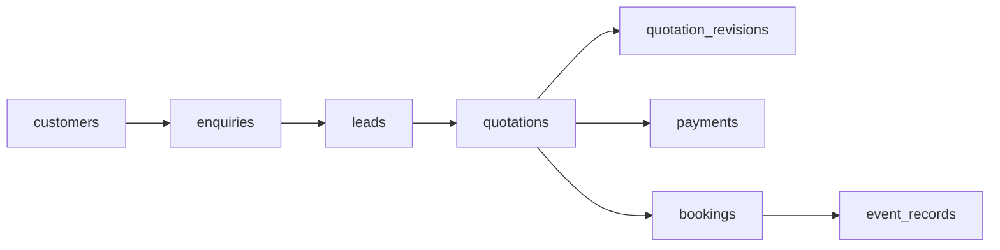
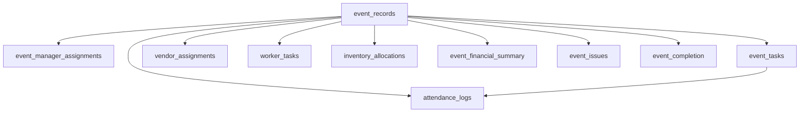
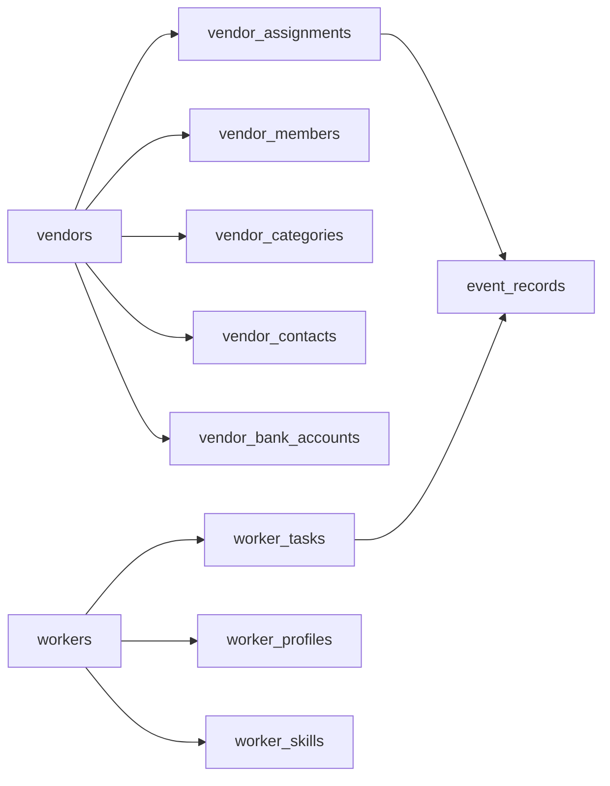
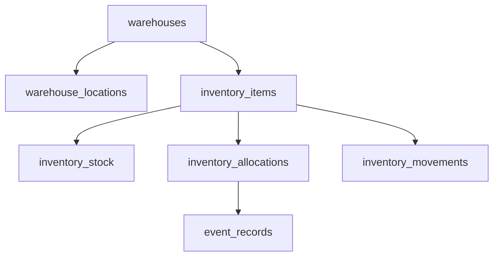
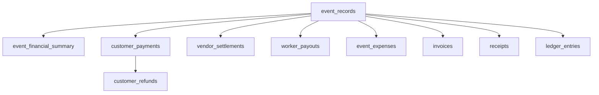
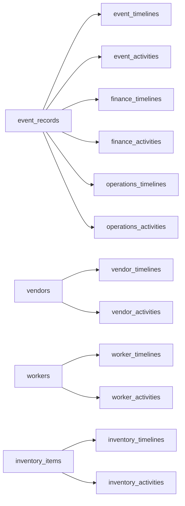
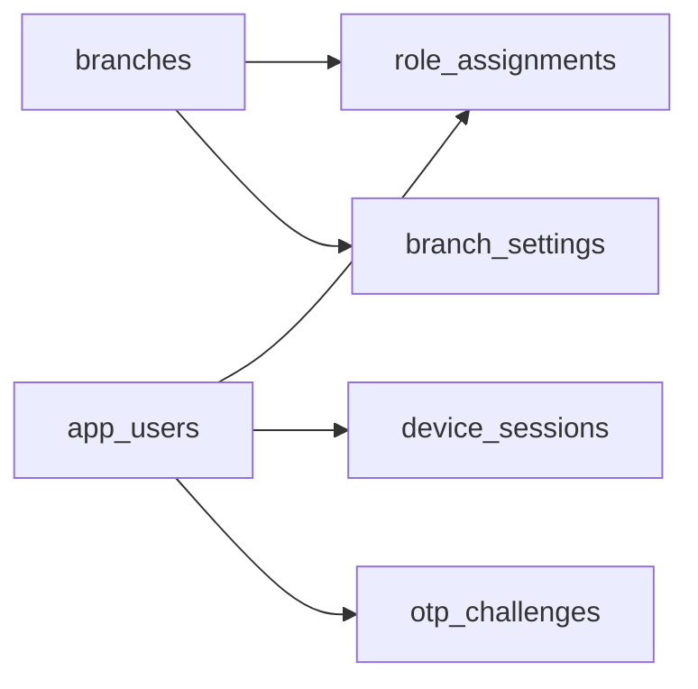

# Entity Relationship Diagrams

Relationship maps below use **only foreign-key edges that exist in migrations
`0001`–`0013`**. They are simplified for readability (not every child table is
drawn).

---

## 1. Sales path to Event Record

Enquiry creates a CRM lead in the same application write. Advance payment
confirmation creates booking and event record together (application layer).
Schema relationships:

Supporting tables (not all shown): `quotation_items`, `quotation_activities`,
`quotation_documents`, `payment_plans`, `booking_activities`,
`lead_activities`, catalog `event_types` / `service_categories`.

---

## 2. Event Record spokes

After `event_records` exists, fulfilment and operations attach to the event
(and often to `branch_id`).

Additional event children from `0005` / `0006` / `0011`: `event_timelines`,
`event_activities`, `event_notes`, `event_documents`, `event_status_history`,
`event_task_comments`, `event_progress_updates`, `event_daily_reports`,
`task_assignments`, `event_progress`, `event_photos`, `material_usage`.

---

## 3. Vendor and worker registries

---

## 4. Inventory / warehouse

Related: `inventory_units`, `inventory_returns`, `inventory_damage_reports`,
`inventory_maintenance`, `inventory_photos`, `inventory_notes`, categories and
suppliers.

---

## 5. Finance

Supporting reference data: `finance_accounts`, `payment_methods`,
`expense_categories`, `vendor_bills`, `finance_transactions`.

---

## 6. Pattern B history edges

Foundation companions (not FK’d to a single aggregate type): `audit_events`,
`outbox_events` (`0001`). Behavioral rules:
[Pattern B Specification](../02-architecture/pattern-b.md). Schema catalog:
[pattern-b-tables.md](./pattern-b-tables.md).

---

## 7. Platform identity

---

## Related

- [schema-overview.md](./schema-overview.md) — full table lists by migration
- [migrations.md](./migrations.md) — file order
