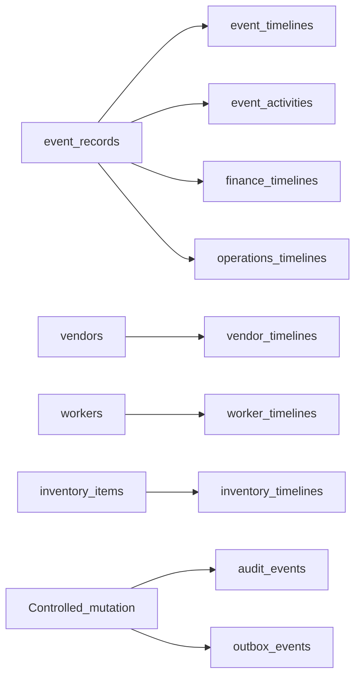

# Pattern B Tables

Schema catalog for Pattern B companion tables. For **behavior** (helpers,
transaction rules, module coverage, anti-patterns), use the canonical
[Pattern B Specification](../02-architecture/pattern-b.md).

---

## Foundation companions (`0001_platform_foundation.sql`)

| Table           | Role                                                         |
| --------------- | ------------------------------------------------------------ |
| `audit_events`  | Append-only audit log (UPDATE/DELETE rejected by triggers)   |
| `outbox_events` | Asynchronous delivery queue (`status` defaults to `pending`) |

These are written by `writeAuditOutbox` (and some older inline audit paths).
They are not FK’d to a single domain aggregate type.

---

## Event-anchored history (`0005_event_records.sql`)

| Table              | FK                | References          |
| ------------------ | ----------------- | ------------------- |
| `event_timelines`  | `event_record_id` | `event_records(id)` |
| `event_activities` | `event_record_id` | `event_records(id)` |

### CHECK widen (`0012_pattern_b_inventory_cancelled.sql`)

No new tables. Extends `event_timelines.entry_type` to allow
`inventory_cancelled`.

---

## Module-scoped history (`0013_pattern_b_consistency.sql`)

| Module key   | Timeline               | Activity                | FK column         | References            |
| ------------ | ---------------------- | ----------------------- | ----------------- | --------------------- |
| `vendor`     | `vendor_timelines`     | `vendor_activities`     | `vendor_id`       | `vendors(id)`         |
| `worker`     | `worker_timelines`     | `worker_activities`     | `worker_id`       | `workers(id)`         |
| `inventory`  | `inventory_timelines`  | `inventory_activities`  | `item_id`         | `inventory_items(id)` |
| `finance`    | `finance_timelines`    | `finance_activities`    | `event_record_id` | `event_records(id)`   |
| `operations` | `operations_timelines` | `operations_activities` | `event_record_id` | `event_records(id)`   |

Finance and operations module tables are still keyed by `event_record_id`, but
are written through the module helper path (`PatternBModule` in
`append-module-pattern-b.ts`).

Owner indexes for these tables are created in `0013`. Additional FK indexes may
appear in `0014`.

---

## Relationship sketch

---

## Adding tables for a new module key

1. Ship a migration that creates `*_timelines` / `*_activities` with CHECKs and
   owner FK indexes (follow `0013` shape).
2. Extend `PatternBModule` / `MODULE_TABLES` in
   `apps/backend/src/common/pattern-b/append-module-pattern-b.ts`.
3. Call helpers from the adapter inside the same transaction as the domain write.
4. Update [Pattern B Specification](../02-architecture/pattern-b.md) coverage
   and this catalog.

---

## Related

- [transactions.md](./transactions.md)
- [schema-overview.md](./schema-overview.md)
- [erd.md](./erd.md) § Pattern B
- [migrations.md](./migrations.md)
