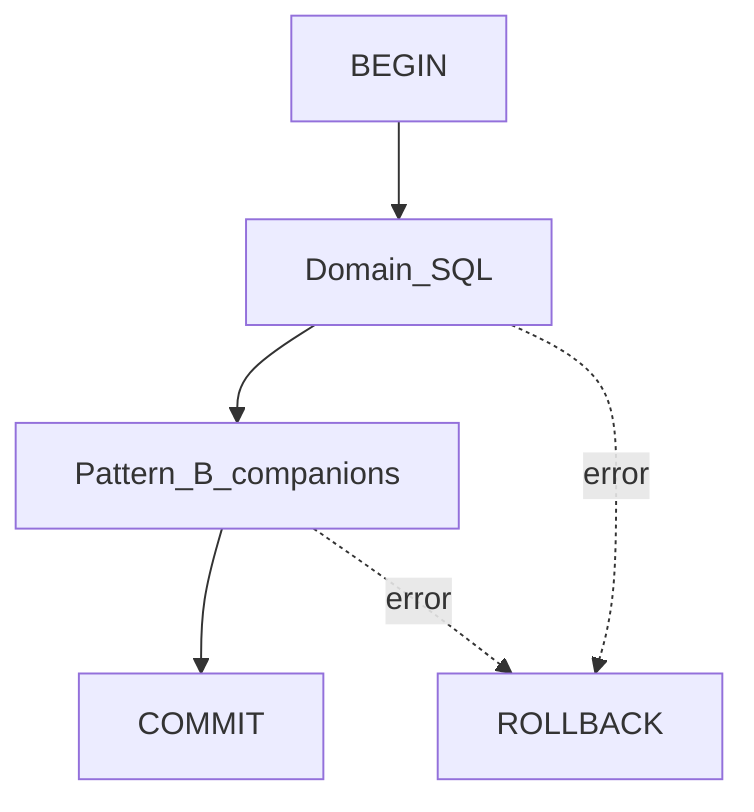

# Transactions

This document describes database transaction boundaries at two layers:
**migration files** and **runtime repository adapters**. Behavioral Pattern B
detail lives in [Pattern B Specification](../02-architecture/pattern-b.md).

---

## Migration-level transactions

Each migration under `infrastructure/postgres/migrations/` wraps DDL/DML in
`BEGIN` / `COMMIT`. A failed migration file does not leave a half-applied
schema for that file when run with `ON_ERROR_STOP=1`.

Apply tracking (`schema_migrations`) is updated by
`apply-migrations.sh` after the file succeeds. See [migrations.md](./migrations.md).

---

## Runtime adapter transactions

Controlled mutations in Postgres adapters follow:



1. Borrow a client from `PG_POOL`
2. `BEGIN`
3. Domain inserts/updates (often `SELECT … FOR UPDATE` on contended rows)
4. Pattern B helpers on the **same** client (timeline, activity, audit, outbox)
5. `COMMIT`, or `ROLLBACK` in `catch`

There is no distributed transaction manager across modules. Multi-aggregate
atomicity (for example enquiry + lead, or advance confirm + booking + event
record) is implemented inside a single adapter transaction when required.

See [Backend Handbook](../02-architecture/backend.md) and
[System Architecture](../02-architecture/architecture.md).

---

## Append-only enforcement

`audit_events` is append-only at the database layer: triggers in
`0001_platform_foundation.sql` reject `UPDATE` and `DELETE`.

Financial and controlled operational history follows the same product rule: no
hard delete of audit/financial truth ([ADR 0005](../adr/0005-persistence-boundary.md)).
Lifecycle is expressed with status CHECKs, not `deleted_at` columns (none exist
in the shipped migrations).

---

## Version columns and concurrency

Many mutable business tables define:

```text
version integer NOT NULL DEFAULT 1 CHECK (version > 0)
```

Adapters typically increment `version` on update and may lock rows with
`FOR UPDATE`.

**Compare-and-set** (`UPDATE … WHERE version = $expected`) is **not** the general
application pattern today. Do not assume CAS rejection semantics unless a
specific query implements them. Prefer the description in
[architecture.md § Database Interaction](../02-architecture/architecture.md).

`outbox_events.aggregate_version` stores the version associated with the
enqueued side effect.

---

## Branch scoping

Phase 1 is Hyderabad-only. Branch-scoped business tables carry `branch_id`
referencing `branches`. The HYD branch is seeded in `0001`. Keep `branch_id` in
new branch-scoped tables even while operating a single branch
([ADR 0010](../adr/0010-connected-hyderabad-platform-phase-one.md)).

---

## Consistency summary

| Concern                    | Guarantee                                                     |
| -------------------------- | ------------------------------------------------------------- |
| Domain + Pattern B inserts | Strong — same runtime transaction                             |
| Outbox delivery            | Eventual — after commit, via `outbox_events` status lifecycle |
| Migration file             | All-or-nothing per file                                       |

---

## Related

- [pattern-b-tables.md](./pattern-b-tables.md)
- [Pattern B Specification](../02-architecture/pattern-b.md)
- [indexing.md](./indexing.md)
