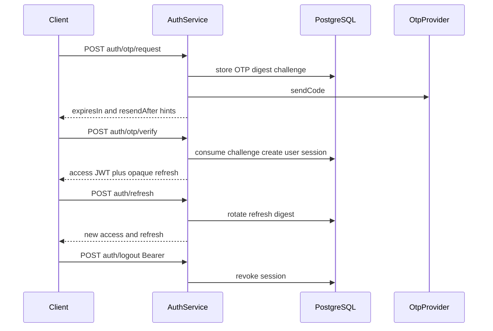

# Authentication

This document describes how Mee Events authenticates callers: phone OTP,
device sessions, opaque refresh tokens, and short-lived JWT access tokens.

Route catalog: [API authentication](../04-api/authentication.md).  
Decision record: [ADR 0002](../adr/0002-identity-and-session-security.md).  
Domain notes: [Identity foundation](./identity-foundation.md).

Implementation:

- `apps/backend/src/modules/identity/presentation/auth.controller.ts`
- `apps/backend/src/modules/identity/application/auth.service.ts`

There is **no** MFA, OAuth, or social login in the shipped backend.

---

## Flows

| Step        | Endpoint                        | Auth   | Behavior                                                                                                                                                         |
| ----------- | ------------------------------- | ------ | ---------------------------------------------------------------------------------------------------------------------------------------------------------------- |
| Request OTP | `POST /api/v1/auth/otp/request` | Public | Normalize E.164 mobile; create challenge; send code via OTP provider                                                                                             |
| Verify OTP  | `POST /api/v1/auth/otp/verify`  | Public | Constant-time digest compare; consume challenge once; create user if needed (default role `customer`); issue session + tokens                                    |
| Refresh     | `POST /api/v1/auth/refresh`     | Public | Rotate opaque refresh; extend session; issue new access JWT                                                                                                      |
| Logout      | `POST /api/v1/auth/logout`      | Bearer | Revoke current device session; invalidate principal cache                                                                                                        |
| Switch role | `POST /api/v1/auth/switch-role` | Bearer | Confirm an active mobile assignment; persist `lastActiveRole`; invalidate all cached principals for the user; issue a new access JWT for the same device session |

---

## TTLs and digests

| Item                            | Value                                         | Storage                                                                             |
| ------------------------------- | --------------------------------------------- | ----------------------------------------------------------------------------------- |
| OTP challenge TTL               | 300 seconds                                   | Challenge row `expiresAt`                                                           |
| OTP resend hint                 | 60 seconds (`resendAfter`)                    | Returned to client; **not** server-enforced as a rate limit today                   |
| OTP max attempts                | 5                                             | Decremented on failed verify                                                        |
| OTP digest                      | HMAC-SHA256 of `` `${challengeId}:${code}` `` | Secret `OTP_HMAC_SECRET`; plaintext never stored                                    |
| Access JWT TTL                  | 900 seconds                                   | Signed with `JWT_ACCESS_SECRET` (see [jwt.md](./jwt.md))                            |
| Device session / refresh window | 30 days                                       | Session `expiresAt`; refresh stored as HMAC digest with `REFRESH_TOKEN_HMAC_SECRET` |
| Refresh token                   | 48 random bytes, base64url                    | Opaque; only digest persisted                                                       |

Verification uses `timingSafeEqual` on digests.

---

## Device sessions and refresh reuse

Each successful verify creates a **device session** bound to a rotating refresh
token digest.

On refresh:

1. Lookup by current refresh digest, or by **previous** digest (rotation window).
2. If the previous digest is presented again → treat as **reuse**: revoke
   session, invalidate principal cache, audit
   `identity.session.revoked` with reason `refresh-token-reuse`.
3. Otherwise rotate to a new refresh digest, keep previous for one-time overlap
   detection, extend session expiry by 30 days, audit
   `identity.session.rotated`.

Logout audits `identity.session.revoked` with reason `logout`.

---

## OTP providers

| Setting                 | Behavior                                                                                                                                                   |
| ----------------------- | ---------------------------------------------------------------------------------------------------------------------------------------------------------- |
| `OTP_PROVIDER=local`    | `LocalOtpProvider` (development/tests). Staging and production startup **reject** the local provider                                                       |
| `OTP_PROVIDER=external` | `ExternalOtpProvider` — boot validation requires `SMS_OTP_ENDPOINT` + `SMS_OTP_API_KEY`; send still fail-closed until the SMS vendor HTTP adapter is wired |

In development with local provider, a debug code may be returned for testing
(mobile auto-fills; ERP login surfaces it). Never log OTPs or tokens in
production logs.

---

## Gaps vs ADR 0002

ADR 0002 calls for server-side request rate limits and resend cooldown
enforcement.

**Implemented now:**

- Challenge attempts and expiry are enforced.
- Per-mobile **resend cooldown** is enforced server-side (`OTP_RESEND_COOLDOWN`
  / HTTP 429) using the latest open challenge’s `resendAfter`.
- A PostgreSQL-backed per-mobile request window allows at most five OTP
  challenges per hour (`OTP_REQUEST_LIMIT` / HTTP 429). Because all replicas
  share PostgreSQL, the limit is enforced across backend instances.

**Still open for production:**

- Edge/IP throttling to limit abuse spread across many mobile numbers.
- Vendor SMS delivery + delivery callbacks.

Treat edge/IP throttling as the remaining rate-limit hardening item
([identity-foundation.md](./identity-foundation.md)).

---

## Related

- [jwt.md](./jwt.md)
- [authorization.md](./authorization.md)
- [auditing.md](./auditing.md)
- [Secret handling](./secrets.md)
