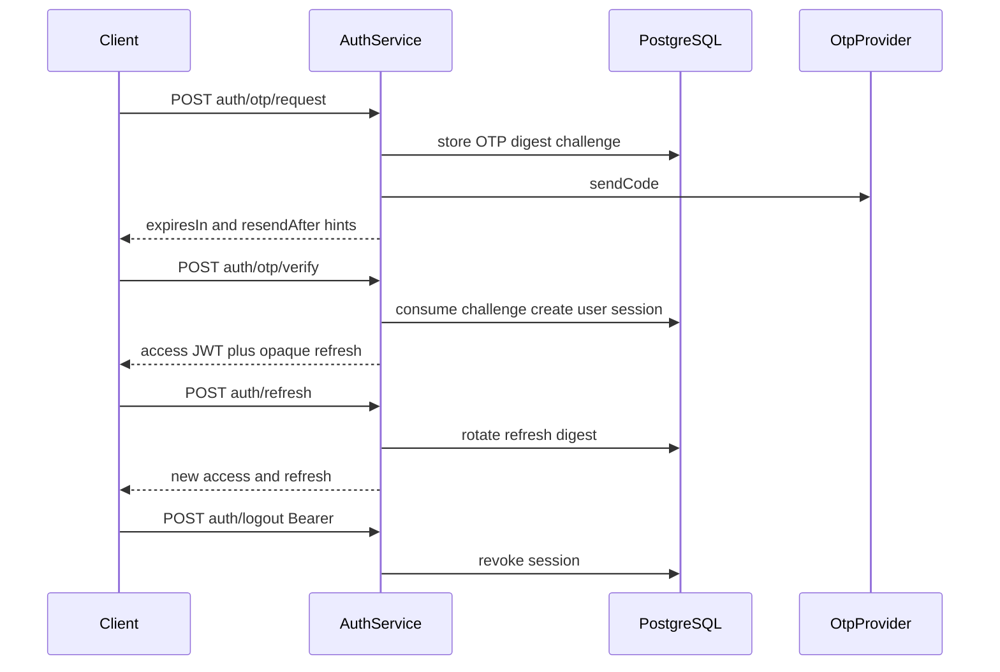

# Authentication

This document describes how Mee Events authenticates callers: phone OTP,
device sessions, opaque refresh tokens, and short-lived JWT access tokens.

Route catalog: [API authentication](../04-api/authentication.md).  
Decision record: [ADR 0002](../adr/0002-identity-and-session-security.md).  
Domain notes: [Identity foundation](./identity-foundation.md).

Implementation:

- `apps/backend/src/modules/identity/presentation/auth.controller.ts`
- `apps/backend/src/modules/identity/application/auth.service.ts`

There is **no** MFA, OAuth, or social login in the shipped backend.

---

## Flows

| Step          | Endpoint                        | Auth   | Behavior                                                                                                                                                         |
| ------------- | ------------------------------- | ------ | ---------------------------------------------------------------------------------------------------------------------------------------------------------------- |
| Request OTP   | `POST /api/v1/auth/otp/request` | Public | Normalize E.164 mobile; create challenge; send code via OTP provider                                                                                             |
| Verify OTP    | `POST /api/v1/auth/otp/verify`  | Public | Constant-time digest compare; consume challenge once; create user if needed (default role `customer`); issue session + tokens                                    |
| Refresh       | `POST /api/v1/auth/refresh`     | Public | Rotate opaque refresh; extend session; issue new access JWT                                                                                                      |
| Logout        | `POST /api/v1/auth/logout`      | Bearer | Revoke current device session; invalidate principal cache                                                                                                        |
| List sessions | `GET /api/v1/auth/sessions`     | Bearer | List the caller’s non-revoked device sessions (`id`, `deviceId`, timestamps, `current`). No refresh tokens.                                                      |
| Logout all    | `POST /api/v1/auth/logout-all`  | Bearer | Revoke every active session for the caller; invalidate principal cache for the user                                                                              |
| Switch role   | `POST /api/v1/auth/switch-role` | Bearer | Confirm an active mobile assignment; persist `lastActiveRole`; invalidate all cached principals for the user; issue a new access JWT for the same device session |

---

## TTLs and digests

| Item                            | Value                                         | Storage                                                                                                                  |
| ------------------------------- | --------------------------------------------- | ------------------------------------------------------------------------------------------------------------------------ |
| OTP challenge TTL               | 300 seconds                                   | Challenge row `expiresAt`                                                                                                |
| OTP resend cooldown             | 60 seconds (`resendAfter`)                    | Hint returned to the client **and** enforced server-side (`OTP_RESEND_COOLDOWN` / HTTP 429 on the latest open challenge) |
| OTP max attempts                | 5                                             | Decremented on failed verify                                                                                             |
| OTP digest                      | HMAC-SHA256 of `` `${challengeId}:${code}` `` | Secret `OTP_HMAC_SECRET`; plaintext never stored                                                                         |
| Access JWT TTL                  | 900 seconds                                   | Signed with `JWT_ACCESS_SECRET` (see [jwt.md](./jwt.md))                                                                 |
| Device session / refresh window | 30 days                                       | Session `expiresAt`; refresh stored as HMAC digest with `REFRESH_TOKEN_HMAC_SECRET`                                      |
| Refresh token                   | 48 random bytes, base64url                    | Opaque; only digest persisted                                                                                            |

Verification uses `timingSafeEqual` on digests.

---

## Device sessions and refresh reuse

Each successful verify creates a **device session** bound to a rotating refresh
token digest.

On refresh:

1. A process-local in-flight guard rejects duplicate work already active in the
   same `AuthService` instance.
2. PostgreSQL establishes a `REPEATABLE READ` snapshot, finds the current or
   previous digest, and locks the existing device-session row.
3. A current digest rotates through the conditional digest CAS. If another API
   instance observed that same current row, PostgreSQL serialization maps the
   loser to controlled `SESSION_REFRESH_CONFLICT`; it is not classified as
   theft and receives no credentials.
4. A later request that observes the digest as **previous** is genuine reuse:
   revoke the session, write `identity.session.revoked` with reason
   `refresh-token-reuse` in the **same transaction**, invalidate principal
   cache, and reject the rotated token afterward.
5. A successful rotation extends expiry by 30 days and writes
   `identity.session.rotated` in that same transaction.

The row lock uses the existing session row; no token/digest advisory-lock key,
new table, grace window, retry, or sleep is involved.

OTP verify consumes the challenge, creates the user if needed, inserts the
device session, and writes `identity.user.created` / `identity.session.created`
in **one** transaction (`completeOtpVerification`). A concurrent correct verify
loses the consume and fails closed (`OTP_CHALLENGE_INVALID`).

Mobile persists a stable installation ID in secure storage
(`mee_events.installation_id.v1`). The same install reuses the same `deviceId`;
a new install may generate a new one and does not take over the old session.
ERP Web already stores a stable id in `localStorage`.

`GET /api/v1/auth/sessions` lists the caller’s non-revoked sessions without
tokens. `POST /api/v1/auth/logout-all` revokes every active session for that
user. Logout of the current device remains `POST /api/v1/auth/logout`.

SEC-03 is **done with findings**. Remaining limits (session UI, 15s
process-local principal cache across API instances, HTTP E2E, SMS vendor) are
listed in [sec-03-session-control-inventory.md](./sec-03-session-control-inventory.md).
This is not a production-security claim.

Logout audits `identity.session.revoked` with reason `logout` in the same
transaction as the revoke. Revoke-all audits `identity.sessions.revoked` with
reason `logout-all` (count only; no tokens).

---

## OTP providers

| Setting                 | Behavior                                                                                                                                                   |
| ----------------------- | ---------------------------------------------------------------------------------------------------------------------------------------------------------- |
| `OTP_PROVIDER=local`    | `LocalOtpProvider` (development/tests). Staging and production startup **reject** the local provider                                                       |
| `OTP_PROVIDER=external` | `ExternalOtpProvider` — boot validation requires `SMS_OTP_ENDPOINT` + `SMS_OTP_API_KEY`; send still fail-closed until the SMS vendor HTTP adapter is wired |

In development with local provider, a debug code may be returned for testing
(mobile auto-fills; ERP login surfaces it). Never log OTPs or tokens in
production logs.

---

## Gaps vs ADR 0002

ADR 0002 calls for server-side request rate limits and resend cooldown
enforcement.

**Implemented now:**

- Challenge attempts and expiry are enforced.
- Per-mobile **resend cooldown** is enforced server-side (`OTP_RESEND_COOLDOWN`
  / HTTP 429) using the latest open challenge’s `resendAfter`.
- A PostgreSQL-backed per-mobile request window allows at most five OTP
  challenges per hour (`OTP_REQUEST_LIMIT` / HTTP 429). Because all replicas
  share PostgreSQL, the limit is enforced across backend instances.
- A **process-local** IP cap on `POST /api/v1/auth/otp/request` and
  `POST /api/v1/auth/otp/verify` (`AUTH_IP_RATE_LIMIT` / HTTP 429, 30 hits /
  10 minutes / process). It is **not** shared across API instances and is **not**
  a CDN/WAF.

**Still open for production:**

- Shared edge/IP throttling (CDN/WAF or Redis) across replicas.
- Vendor SMS delivery + delivery callbacks.

Treat a real edge limiter as remaining production hardening
([identity-foundation.md](./identity-foundation.md)).
SEC-05 closed the in-process IP cap with findings
([sec-05-web-api-hardening-inventory.md](./sec-05-web-api-hardening-inventory.md)).

---

## Mobile post-auth boundary

After a stored Nest session is restored, Flutter requests
`GET /api/v1/platform/bootstrap` through `MobileApi`. SEC-06 removed Flutter
Supabase initialization and direct table access. The bootstrap parser now
requires the contract metadata plus valid actor, branch, client, access, and
control structures; validates the role/surface/landing-module catalogs; and
requires the active role to have an assigned active role for the selected
branch. Unknown, missing, malformed, mismatched, or non-Hyderabad bootstrap
data cannot open a mobile product workspace. Employee-class roles remain on
the existing ERP-only message. Bootstrap failures show a generic retry/sign-out
state without rendering raw parser, provider, URL, or token details.

This is local parser/widget evidence, not live staging/production or native
device proof. See
[sec-06-mobile-boundary-inventory.md](./sec-06-mobile-boundary-inventory.md).

---

## Related

- [jwt.md](./jwt.md)
- [authorization.md](./authorization.md)
- [auditing.md](./auditing.md)
- [Secret handling](./secrets.md)
