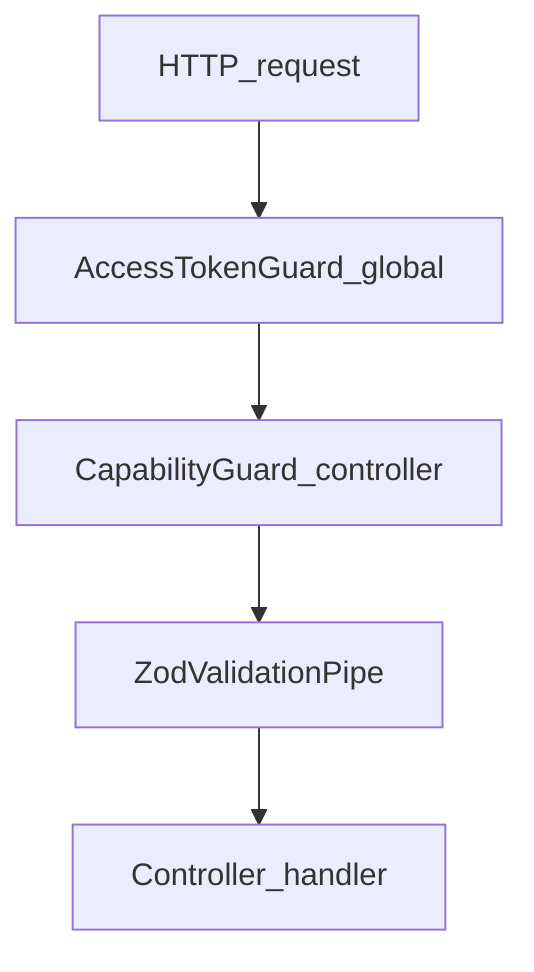

# Authorization

Authentication proves who the caller is. Authorization decides what they may
do. Mee Events uses **capability-based** checks on controlled endpoints after a
valid access token is established.

See also: [jwt.md](./jwt.md), [capabilities.md](./capabilities.md),
[Architecture — Security](../02-architecture/architecture.md).

---

## Guard order



1. **AccessTokenGuard** (global `APP_GUARD`) — skip if `@Public`; else verify JWT
   and attach principal ([jwt.md](./jwt.md)).
2. **CapabilityGuard** — on controllers that opt in with `@UseGuards(CapabilityGuard)`.
3. **ZodValidationPipe** — per-parameter body/query validation.
4. Handler / application service.

CapabilityGuard **must** run after AccessTokenGuard so `request.user` exists
(`capability.guard.ts` comment).

---

## Public endpoints

`@Public()` skips access-token authentication. Current public surfaces:

| Area    | Routes                                                   |
| ------- | -------------------------------------------------------- |
| Health  | `GET /api/v1/health/live`, `GET /api/v1/health/ready`    |
| Auth    | `POST /api/v1/auth/otp/request`, `otp/verify`, `refresh` |
| Catalog | `GET /api/v1/catalog/event-types`, `service-categories`  |

`POST /api/v1/auth/logout` and `GET /api/v1/platform/bootstrap` require Bearer
auth. Bootstrap has **no** `@RequireCapability` — any authenticated principal
may load their effective capability set.

Full route tables: [docs/04-api](../04-api/README.md).

---

## Capability enforcement

Controllers declare:

```text
@UseGuards(CapabilityGuard)
@RequireCapability("<capability.id>")
```

`CapabilityGuard` behavior:

| Condition                                                           | Result                         |
| ------------------------------------------------------------------- | ------------------------------ |
| Missing `@RequireCapability` on a CapabilityGuard-protected handler | `403` — endpoint misconfigured |
| No `request.user`                                                   | `401`                          |
| Active role lacks the capability in `ROLE_CAPABILITIES`             | `403`                          |
| Capability granted                                                  | Allow                          |

Policy map lives in
`apps/backend/src/modules/platform-foundation/domain/platform-foundation.ts`
(`ROLE_CAPABILITIES`). Details: [capabilities.md](./capabilities.md).

Clients may hide UI from bootstrap capabilities; **server checks are
authoritative**.

Bootstrap is descriptive, not an authorization token. Its capability list can
never grant an API action: each protected route re-evaluates the authenticated
principal and its server-side capability, branch, ownership, or active vendor
membership rules. Role grants preserve their `global`, `branch`, or `vendor`
scope type; supported Phase 1 pairings are documented in
[branch-context.md](./branch-context.md).

Vendor self-resource routes use one reusable service rule. The caller must have
an active `vendor_owner` or `vendor_member` role, an active assignment for that
role whose vendor scope equals the requested vendor (or whose branch scope is
Hyderabad), and an active `vendor_members` relationship for the same vendor.
Membership narrows a branch grant; it never replaces the role grant. A grant
for Vendor A plus membership in Vendor B cannot authorize Vendor B. Dashboard,
assignment list/detail, accept/reject/progress, and note paths all use this
intersection.

---

## RolesGuard

`RolesGuard` and `@RequireRoles` exist under
`apps/backend/src/modules/authorization/` but are **not** used on presentation
controllers today. Do not treat role-decorator guards as the active
authorization path.

---

## Related

- [Backend Handbook — Authorization](../02-architecture/backend.md)
- [authentication.md](./authentication.md)
- [branch-context.md](./branch-context.md)
