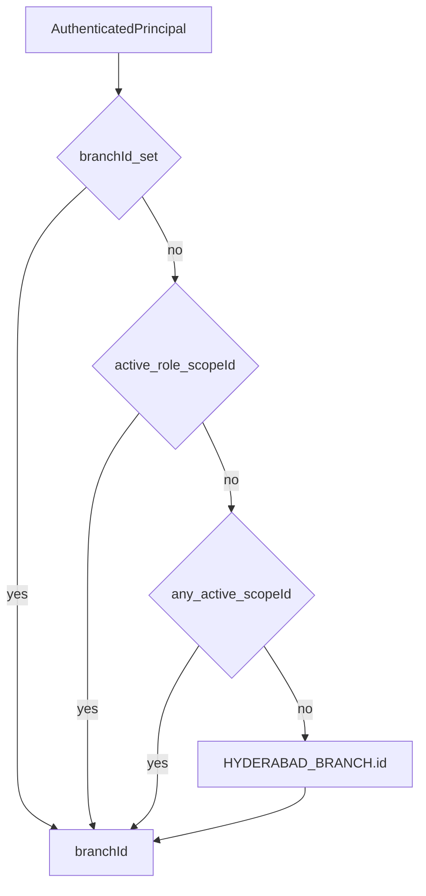

# Branch Context

Phase 1 Mee Events operates a **single active branch**: Hyderabad (`HYD`).
Every authenticated principal still receives a resolved `branchId` so queries
and audit rows stay branch-scoped for later multi-branch expansion
([ADR 0010](../adr/0010-connected-hyderabad-platform-phase-one.md)).

Implementation: `apps/backend/src/common/branch/branch-context.ts`.

---

## Default branch

`HYDERABAD_BRANCH` in
`apps/backend/src/modules/platform-foundation/domain/platform-foundation.ts`:

| Field       | Value                                  |
| ----------- | -------------------------------------- |
| id          | `00000000-0000-4000-8000-000000000001` |
| code        | `HYD`                                  |
| name / city | Hyderabad                              |
| timezone    | `Asia/Kolkata`                         |
| currency    | `INR`                                  |

Seeded in migration `0001_platform_foundation.sql`.

---

## resolveBranchId

Precedence:

1. Existing `principal.branchId` if already set
2. Active role assignment matching `activeRole` with a non-empty `scopeId`
3. Any other active assignment with a non-empty `scopeId`
4. Else `HYDERABAD_BRANCH.id`

`AccessTokenGuard` attaches `branchId: resolveBranchId(principal)` before
caching the principal ([jwt.md](./jwt.md)).

---

## Repository and audit usage

- Controllers/services pass the resolved `branchId` into mutation context.
- Repositories **must** use that value for branch-scoped SQL — do not import
  `HYDERABAD_BRANCH` inside query methods for authorization bypass.
- Pattern B `writeAuditOutbox` accepts `branchId` for `audit_events.branch_id`
  ([auditing.md](./auditing.md), [Pattern B](../02-architecture/pattern-b.md)).
- Identity `AUDIT_SINK` security events may omit `branchId` (column nullable).

There is **no** multi-branch JWT claim set yet. Branch comes from role scope or
the platform default.

---

## Related

- [authorization.md](./authorization.md)
- [Database transactions — branch scoping](../03-database/transactions.md)
- [Architecture](../02-architecture/architecture.md)
