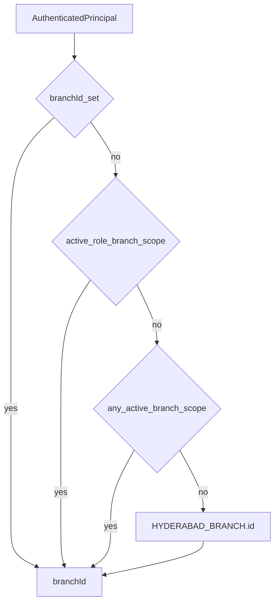

# Branch Context

Phase 1 Mee Events operates a **single active operational branch**: Hyderabad
(`HYD`). Every authenticated principal still receives a resolved `branchId` so
queries and audit rows stay branch-scoped for later multi-branch expansion
([ADR 0010](../adr/0010-connected-hyderabad-platform-phase-one.md)).

Operational branch and role/resource scope are different values. A role grant
keeps its PostgreSQL `scopeType` (`global`, `branch`, or `vendor`) plus optional
`scopeId`; `branchId` remains the Hyderabad execution context. In particular, a
vendor UUID is never interpreted as a branch UUID.

Implementation: `apps/backend/src/common/branch/branch-context.ts`.

---

## Default branch

`HYDERABAD_BRANCH` in
`apps/backend/src/modules/platform-foundation/domain/platform-foundation.ts`:

| Field       | Value                                  |
| ----------- | -------------------------------------- |
| id          | `00000000-0000-4000-8000-000000000001` |
| code        | `HYD`                                  |
| name / city | Hyderabad                              |
| timezone    | `Asia/Kolkata`                         |
| currency    | `INR`                                  |

Seeded in migration `0001_platform_foundation.sql`.

---

## resolveBranchId

Precedence:

1. Existing `principal.branchId` if already set
2. Active-role assignment with `scopeType: branch` and a non-empty `scopeId`
3. Any other active `scopeType: branch` assignment with a non-empty `scopeId`
4. Else `HYDERABAD_BRANCH.id`

`AccessTokenGuard` attaches `branchId: resolveBranchId(principal)` before
caching the principal ([jwt.md](./jwt.md)).

## Phase 1 role-scope policy

`role-scope-policy.ts` validates every assignment before it can authorize a
principal or appear in bootstrap:

| Scope type | Accepted Phase 1 pairing                                 |
| ---------- | -------------------------------------------------------- |
| `branch`   | Any platform role at the canonical Hyderabad branch UUID |
| `global`   | `administrator` only, with no `scopeId`                  |
| `vendor`   | `vendor_owner` or `vendor_member`, with a vendor UUID    |

Unsupported pairings, non-Hyderabad branch grants, malformed scope IDs, exact
duplicate grants, and inactive-only active-role agreement fail closed. Multiple
distinct legitimate grants are retained. Vendor-resource operations still
require the active vendor role, a qualifying assignment for that role, and an
active `vendor_members` ownership/membership row for the same requested vendor.
An exact vendor-scoped grant cannot authorize another vendor; a Hyderabad
branch-scoped vendor grant is narrowed to the caller's active memberships. A
role grant or membership alone does not authorize a vendor resource.

---

## Repository and audit usage

- Controllers/services pass the resolved `branchId` into mutation context.
- Repositories **must** use that value for branch-scoped SQL — do not import
  `HYDERABAD_BRANCH` inside query methods for authorization bypass.
- Employee UUID get/lock/update must include the resolved branch (SEC-02).
  Cross-branch access is **404**, same as missing. Inventory:
  [sec-02-branch-bola-inventory.md](./sec-02-branch-bola-inventory.md).
- Pattern B `writeAuditOutbox` accepts `branchId` for `audit_events.branch_id`
  ([auditing.md](./auditing.md), [Pattern B](../02-architecture/pattern-b.md)).
- Identity `AUDIT_SINK` security events may omit `branchId` (column nullable).

There is **no** multi-branch JWT claim set yet. Branch comes only from an
explicit operational `branchId`, a branch-typed grant, or the Hyderabad
default. Global and vendor grants do not select an operational branch.

---

## Related

- [authorization.md](./authorization.md)
- [Database transactions — branch scoping](../03-database/transactions.md)
- [Architecture](../02-architecture/architecture.md)
