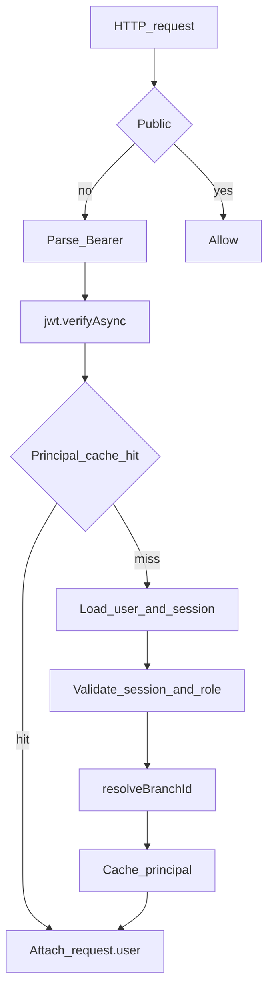

# JWT Access Tokens

Access tokens are short-lived JWTs. Refresh tokens are **opaque** and are not
JWTs (see [authentication.md](./authentication.md)).

Implementation:

- Issued in `apps/backend/src/modules/identity/application/auth.service.ts`
- Verified in `apps/backend/src/modules/platform-foundation/security/access-token.guard.ts`
- Cached briefly in `auth-principal-cache.ts`

---

## Claims and signing

| Claim  | Meaning                            |
| ------ | ---------------------------------- |
| `sub`  | User id (`app_users.id`)           |
| `sid`  | Device session id                  |
| `role` | Active platform role at issue time |

| Property           | Value                                     |
| ------------------ | ----------------------------------------- |
| Algorithm / secret | Nest `JwtModule` with `JWT_ACCESS_SECRET` |
| TTL                | 900 seconds (`expiresIn`)                 |
| Transport          | `Authorization: Bearer <access_token>`    |

Clients must not put signing secrets in Flutter or `NEXT_PUBLIC_*` builds
([secrets.md](./secrets.md)).

---

## AccessTokenGuard

Registered as the global `APP_GUARD` in `app.module.ts`.

Validation after verify (cache miss path):

1. User and session exist; `session.userId === user.id`
2. Session not revoked and not expired
3. `user.lastActiveRole === claims.role`
4. Role is present in active `roleAssignments`
5. Attach principal with `branchId` from `resolveBranchId`
   ([branch-context.md](./branch-context.md))

Failures yield `401 Unauthorized`.

---

## Principal cache

Process-local cache (`AuthPrincipalCache`):

| Setting     | Value                |
| ----------- | -------------------- |
| Key         | `sessionId` + `role` |
| TTL         | 15 seconds           |
| Max entries | 10,000               |

Invalidated on logout, refresh-token reuse revoke, and account-level role
switch (`invalidateUser`). A role switch updates `app_users.last_active_role`,
issues a new access token for the same device session, and calls
`invalidateUser()` so stale role tokens fail in **the current backend process**.
Immediate invalidation is not guaranteed across multiple backend replicas.
Shared Redis-backed invalidation, or an equivalent distributed mechanism, is
required before multi-replica deployment. Redis is not implemented in the
current process-local cache.

---

## Related

- [authentication.md](./authentication.md)
- [authorization.md](./authorization.md)
- [Architecture — Security](../02-architecture/architecture.md)
