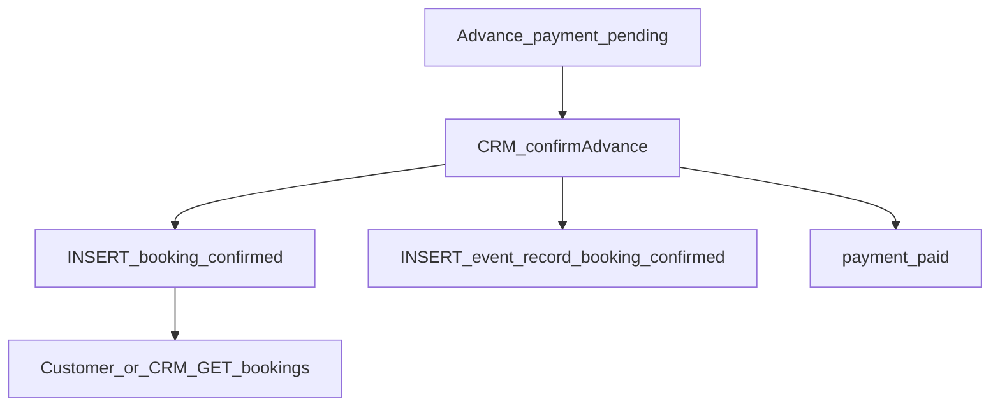

# Booking Workflow

A booking is the commercial confirmation record created when CRM confirms an
advance payment. After creation, APIs are **read-only**.

Routes: [customer API](../04-api/customer.md), [CRM API](../04-api/crm.md).

---

## Flow

---

## Steps

| Step           | Actor              | API                                                        | Effect                                                                                   |
| -------------- | ------------------ | ---------------------------------------------------------- | ---------------------------------------------------------------------------------------- |
| Create         | CRM (via payments) | `POST /api/v1/crm/payments/:id/confirm`                    | Same TX as payment `paid` + event record `booking_confirmed`; booking status `confirmed` |
| List / get own | Customer           | `GET /api/v1/bookings`, `GET /api/v1/bookings/:id`         | Read                                                                                     |
| List / get CRM | CRM                | `GET /api/v1/crm/bookings`, `GET /api/v1/crm/bookings/:id` | Read                                                                                     |

There is **no** `POST /bookings` (or CRM equivalent) create endpoint.

---

## Statuses

`bookingStatuses` in `packages/api-contracts`: `confirmed`, `cancelled`.

Bookings are inserted as `confirmed`. A cancel **write path is not implemented**
in the bookings module today.

---

## Gaps

- Provisional / pre-payment booking
- Booking cancel endpoint
- Creating a booking without confirmed advance

---

## Related

- [enquiry-to-booking.md](./enquiry-to-booking.md)
- [event-lifecycle.md](./event-lifecycle.md)
- [quotation.md](./quotation.md)
