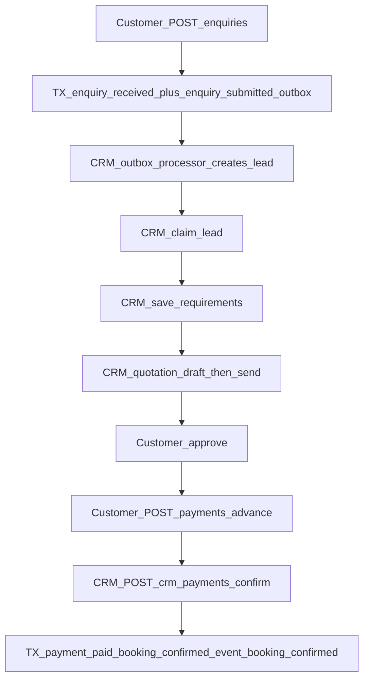

# Enquiry to Booking

End-to-end sale pipeline from customer enquiry through CRM qualification,
quotation approval, advance payment, and creation of the booking and Event
Record.

High-level diagram also appears in [Engineering Overview §6](../01-overview/README.md).
Routes: [customer API](../04-api/customer.md), [CRM API](../04-api/crm.md).

---

## Flow

---

## Steps

| Step               | Actor          | API                                       | Effect                                                                                                                                                                            |
| ------------------ | -------------- | ----------------------------------------- | --------------------------------------------------------------------------------------------------------------------------------------------------------------------------------- |
| 1. Create enquiry  | Customer       | `POST /api/v1/enquiries`                  | **One TX:** enquiry `received` + `enquiry.submitted` outbox. CRM lead `new` is created later by `EnquirySubmittedOutboxProcessor` (SEC-04 lease/recovery for live processors)     |
| 2. Claim lead      | CRM            | `POST /api/v1/crm/leads/:id/claim`        | Lead → `claimed`; enquiry → `contact_pending` when previously submitted/received                                                                                                  |
| 3. Requirements    | CRM            | `POST /api/v1/crm/leads/:id/requirements` | Lead → `contacted` or `qualified`; enquiry → `in_discussion` (lead must be claimed)                                                                                               |
| 4. Quotation       | CRM / Customer | See [quotation.md](./quotation.md)        | Draft → send → customer approve (or reject / request revision)                                                                                                                    |
| 5. Submit advance  | Customer       | `POST /api/v1/payments/advance`           | Payment row `pending`                                                                                                                                                             |
| 6. Confirm advance | CRM            | `POST /api/v1/crm/payments/:id/confirm`   | **One TX:** payment → `paid`; **INSERT booking** `confirmed`; lead → `converted`; enquiry → `closed`; **INSERT event_record** `booking_confirmed` (+ timeline seed); audit/outbox |

There is **no** separate “create booking” endpoint. Booking exists only after
successful confirm.

---

## Statuses involved

Defined in `packages/api-contracts` (enquiry, lead, quotation, payment, booking,
event record status enums). Typical path:

| Entity       | Progression on happy path                                                      |
| ------------ | ------------------------------------------------------------------------------ |
| Enquiry      | `received` → `contact_pending` → `in_discussion` → `closed`                    |
| Lead         | `new` → `claimed` → `contacted`/`qualified` → `quoted` (on send) → `converted` |
| Quotation    | `draft` → `sent` → `approved`                                                  |
| Payment      | `pending` → `paid`                                                             |
| Booking      | created as `confirmed`                                                         |
| Event record | created as `booking_confirmed`                                                 |

Reject quotation can mark lead `lost` and enquiry `closed` (see quotation flow).

---

## Gaps

- Customer feedback after completion — not implemented
- Booking before payment — not supported
- Unused enquiry enum values may exist without writes on this path
- CRM lead creation is asynchronous (`enquiry.submitted` outbox). Crash/retry
  recovery for the live processors is in `SEC-04`
  (`docs/05-security/sec-04-outbox-reliability-inventory.md`). Other outbox
  topics still have no consumer. Do not document this as a same-write.

---

## Related

- [quotation.md](./quotation.md)
- [booking.md](./booking.md)
- [event-lifecycle.md](./event-lifecycle.md)
- [finance-flow.md](./finance-flow.md) — post-booking finance module (separate from advance confirm)
