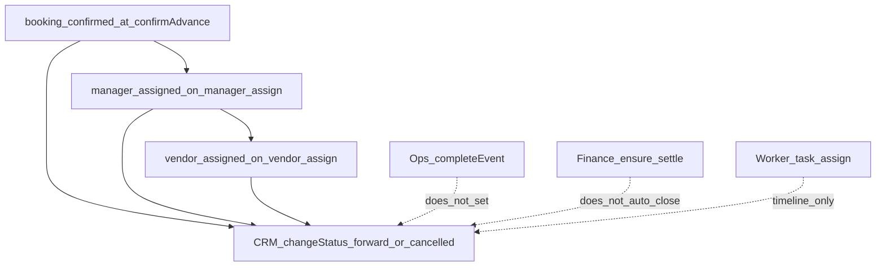

# Event Record Lifecycle

The Event Record is the central fulfilment aggregate. It is born when advance
payment is confirmed and then progresses through planning, assignments,
execution, and settlement-related statuses.

Routes: [CRM events](../04-api/crm.md), [customer events](../04-api/customer.md).
Also: [manager](../04-api/manager.md), [vendor](../04-api/vendor.md),
[worker](../04-api/worker.md), [operations](../04-api/operations.md),
[finance](../04-api/finance.md).

---

## Flow



Inventory allocation is a **sibling** module attached to the event; it does not
own `event_records.status` (see [inventory API](../04-api/inventory.md)).

---

## Steps

| Step                         | Actor            | API / trigger                              | Effect on `event_records.status`                                                        |
| ---------------------------- | ---------------- | ------------------------------------------ | --------------------------------------------------------------------------------------- |
| Birth                        | CRM via payments | Advance confirm TX                         | Insert as `booking_confirmed`                                                           |
| Optional create-from-booking | CRM              | `POST /api/v1/crm/events`                  | Recovery create if needed                                                               |
| Update / notes / timeline    | CRM              | `PATCH` / notes / timeline routes          | Details; Pattern B companions on controlled writes                                      |
| Read                         | Customer / CRM   | `GET /events`, `GET /crm/events`           | Read timeline/activities                                                                |
| Manager assign               | CRM manager      | `POST /crm/manager/events/:eventId/assign` | Auto → `manager_assigned` when current is `booking_confirmed`                           |
| Vendor assign                | CRM vendors      | Assign assignment                          | Auto → `vendor_assigned` when current is `manager_assigned` or `booking_confirmed`      |
| Worker assign                | CRM workers      | Assign task                                | Event **timeline** `worker_assigned`; **no** automatic status bump to `worker_assigned` |
| Manual status                | CRM              | `POST /crm/events/:id/status`              | Forward along ordered list, or `cancelled` (not from `closed`/`cancelled`)              |
| Ops complete                 | CRM ops          | `POST …/complete`                          | Completes ops completion/progress rows — **does not** set event to `completed`          |
| Finance ensure / settle      | CRM finance      | `/crm/finance/...`                         | Does **not** auto-set `settlement_pending` / `closed`                                   |

Planning is expressed as event status + manager tasks/progress — not a separate
planning module.

---

## Statuses

`eventRecordStatuses` in `packages/api-contracts`:

```text
created
planning
requirements_confirmed
quotation_approved
booking_confirmed
manager_assigned
vendor_assigned
worker_assigned
preparation
ready
event_running
completed
settlement_pending
closed
cancelled
```

Happy-path birth uses `booking_confirmed`. Earlier enum values exist for broader
modeling; CRM `changeStatus` enforces allowed transitions in the event-record
repository.

---

## Gaps

- Feedback / ratings after completion — not implemented (upcoming-action stubs
  still say “future”)
- Auto `worker_assigned` / ops-driven `completed` / finance-driven
  `settlement_pending` or `closed` on the event row
- Inventory does not advance event status by itself

---

## Related

- [booking.md](./booking.md)
- [vendor-flow.md](./vendor-flow.md)
- [worker-flow.md](./worker-flow.md)
- [operations-flow.md](./operations-flow.md)
- [finance-flow.md](./finance-flow.md)
- [Pattern B](../02-architecture/pattern-b.md)
