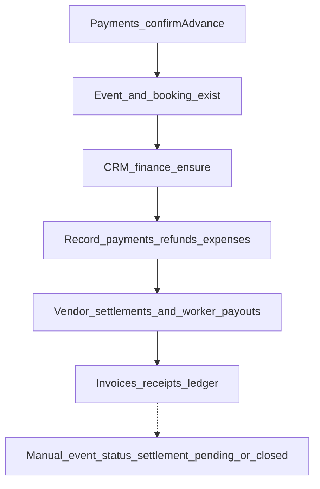

# Finance Flow

Two related surfaces:

1. **Payments module** — customer advance submit + CRM confirm (creates booking
   and event). See [enquiry-to-booking.md](./enquiry-to-booking.md).
2. **Finance module** — event financial summary, further payments/refunds,
   expenses, vendor settlements, worker payouts, invoices, receipts, ledger.

Routes: [finance API](../04-api/finance.md); advance confirm also on
[CRM payments](../04-api/crm.md).

---

## Flow

Advance confirm does **not** call finance ensure. CRM must ensure event finance
separately when using the finance module.

---

## Steps

| Step                         | Actor                        | API                                              | Effect                                        |
| ---------------------------- | ---------------------------- | ------------------------------------------------ | --------------------------------------------- |
| Advance confirm              | CRM                          | `POST /crm/payments/:id/confirm`                 | Booking + event; **not** finance summary seed |
| Ensure event finance         | CRM                          | `POST /crm/finance/events/:eventRecordId/ensure` | Seeds finance row from event budget/advance   |
| Update summary               | CRM                          | `PATCH /crm/finance/events/:eventRecordId`       | Update event finance                          |
| Record payment / refund      | CRM                          | `POST /crm/finance/payments`, `…/refunds`        | Customer payment/refund rows                  |
| Expenses                     | CRM                          | `GET/POST /crm/finance/expenses`                 | Event expenses                                |
| Vendor settlement            | CRM                          | `POST/PATCH /crm/finance/vendors`                | Settlement lifecycle                          |
| Worker payout                | CRM                          | `POST/PATCH /crm/finance/workers`                | Payout lifecycle                              |
| Invoices / receipts / ledger | CRM                          | list/issue/list                                  | Documents and ledger reads                    |
| Self reads                   | Customer (and capable roles) | `GET /finance/me/*`                              | Read-only views                               |

---

## Statuses

Finance-oriented enums in `packages/api-contracts` include (among others):

- Settlement-style statuses (e.g. open / partially settled / settled / closed)
- Customer payment kinds (advance, balance, partial, refund, …)
- Vendor settlement and worker payout status enums

These are distinct from the Payments module `paymentStatuses` used on advance
submit/confirm.

---

## Gaps

- Automatic `event_records` → `settlement_pending` or `closed` after settle
- Feedback after final settlement
- Finance ensure not chained into advance confirm

---

## Related

- [enquiry-to-booking.md](./enquiry-to-booking.md)
- [event-lifecycle.md](./event-lifecycle.md)
- [vendor-flow.md](./vendor-flow.md)
- [worker-flow.md](./worker-flow.md)
