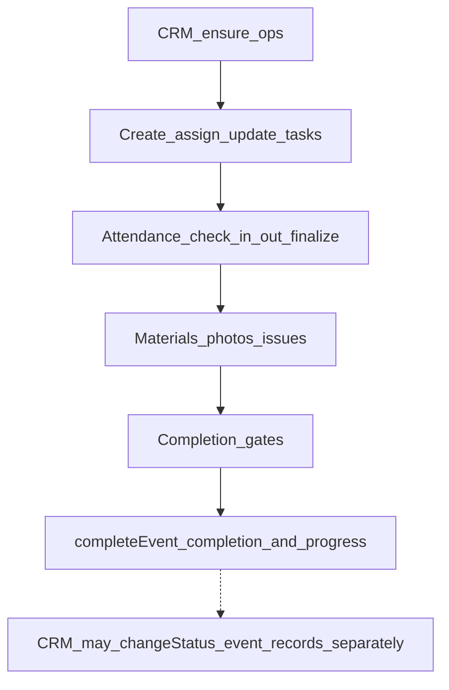

# Operations Flow

Field execution for an event: ensure ops context, tasks, attendance, issues,
materials, photos, progress, and completion gates.

Manager assignment and manager tasks are a related planning layer — see
[manager API](../04-api/manager.md) and [event-lifecycle.md](./event-lifecycle.md).

Routes: [operations API](../04-api/operations.md).

Inventory allocation is adjacent (warehouse custody) but owned by the inventory
module — [inventory API](../04-api/inventory.md).

---

## Flow

---

## Steps

| Step                        | Actor                | API                                                   | Effect                                                                                                         |
| --------------------------- | -------------------- | ----------------------------------------------------- | -------------------------------------------------------------------------------------------------------------- |
| Ensure ops                  | CRM                  | `POST /crm/operations/events/:eventRecordId/ensure`   | Seed ops rows for event                                                                                        |
| Tasks                       | CRM                  | create / assign / patch under `/crm/operations/tasks` | Ops task lifecycle                                                                                             |
| Attendance                  | CRM or assigned self | check-in / check-out / finalize (CRM)                 | Attendance logs                                                                                                |
| Issues / photos / materials | CRM or self          | respective routes                                     | Field evidence and usage                                                                                       |
| Recalculate / checklist     | CRM                  | recalculate; patch completion                         | Progress and checklist                                                                                         |
| Complete event ops          | CRM                  | `POST …/events/:eventRecordId/complete`               | Updates `event_completion` / progress when gates pass — **does not** set `event_records.status` to `completed` |
| Self dashboard / tasks      | Assigned staff       | `/operations/me/*`                                    | Assigned reads and limited updates                                                                             |

### Manager (planning) pointer

| Step                     | Actor               | API                                                                             |
| ------------------------ | ------------------- | ------------------------------------------------------------------------------- |
| Assign manager           | CRM                 | `POST /crm/manager/events/:eventId/assign` (may set event → `manager_assigned`) |
| Manager tasks / progress | CRM or manager self | `/crm/manager/…`, `/manager/…`                                                  |

---

## Completion gates

`completeEvent` requires operational gates such as mandatory tasks done,
attendance finalized, materials finalized, required photos, and checklist
finished (enforced in the operations repository). Passing gates completes the
**operations** completion record, not the Event Record status enum by itself.

---

## Statuses

Ops-related enums in `packages/api-contracts` include task assignment,
attendance, issue, material usage, event progress, and completion statuses
(plus manager assignment / event task statuses for the manager module).

---

## Gaps

- Ops complete → automatic `event_records.completed`
- Feedback after completion
- Inventory movements are not part of the operations service

---

## Related

- [event-lifecycle.md](./event-lifecycle.md)
- [worker-flow.md](./worker-flow.md)
- [vendor-flow.md](./vendor-flow.md)
- [finance-flow.md](./finance-flow.md)
