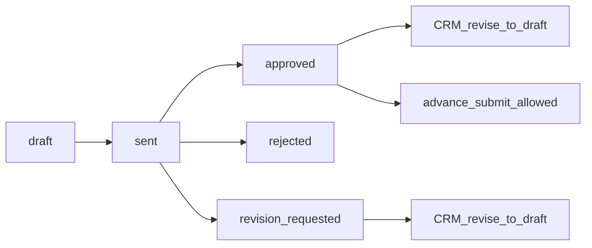

# Quotation Workflow

CRM creates and sends quotations; customers approve, reject, or request
revision. Detail: [customer API](../04-api/customer.md), [CRM API](../04-api/crm.md).

---

## Flow

---

## Steps

| Step             | Actor    | API                                            | Effect                                                                         |
| ---------------- | -------- | ---------------------------------------------- | ------------------------------------------------------------------------------ |
| Create draft     | CRM      | `POST /api/v1/crm/quotations`                  | Status `draft`; items and totals from lead                                     |
| Update draft     | CRM      | `PATCH /api/v1/crm/quotations/:id`             | Only while `draft`                                                             |
| Send             | CRM      | `POST /api/v1/crm/quotations/:id/send`         | `draft` → `sent`; lead → `quoted`; creates `payment_plans`                     |
| Approve          | Customer | `POST /api/v1/quotations/:id/approve`          | → `approved`                                                                   |
| Reject           | Customer | `POST /api/v1/quotations/:id/reject`           | → `rejected`; lead may → `lost`; enquiry may → `closed`                        |
| Request revision | Customer | `POST /api/v1/quotations/:id/request-revision` | → `revision_requested`                                                         |
| Revise           | CRM      | `POST /api/v1/crm/quotations/:id/revise`       | From `sent` / `revision_requested` / `approved` back to `draft` (new revision) |
| Timeline / PDF   | Both     | `GET …/timeline`, `GET …/pdf`                  | PDF is a **placeholder** document, not a rendered file                         |

---

## Statuses

`quotationStatuses` in `packages/api-contracts`:

`draft`, `sent`, `revision_requested`, `approved`, `rejected`, `expired`,
`superseded`

Revision reasons: `initial`, `employee_revise`, `customer_request`.

---

## Gaps

- Automatic `expired` transition — enum exists; no expiry job found
- Explicit write of `superseded` — revise returns to `draft` instead
- Real PDF generation — placeholder only

---

## Related

- [enquiry-to-booking.md](./enquiry-to-booking.md)
- [booking.md](./booking.md)
