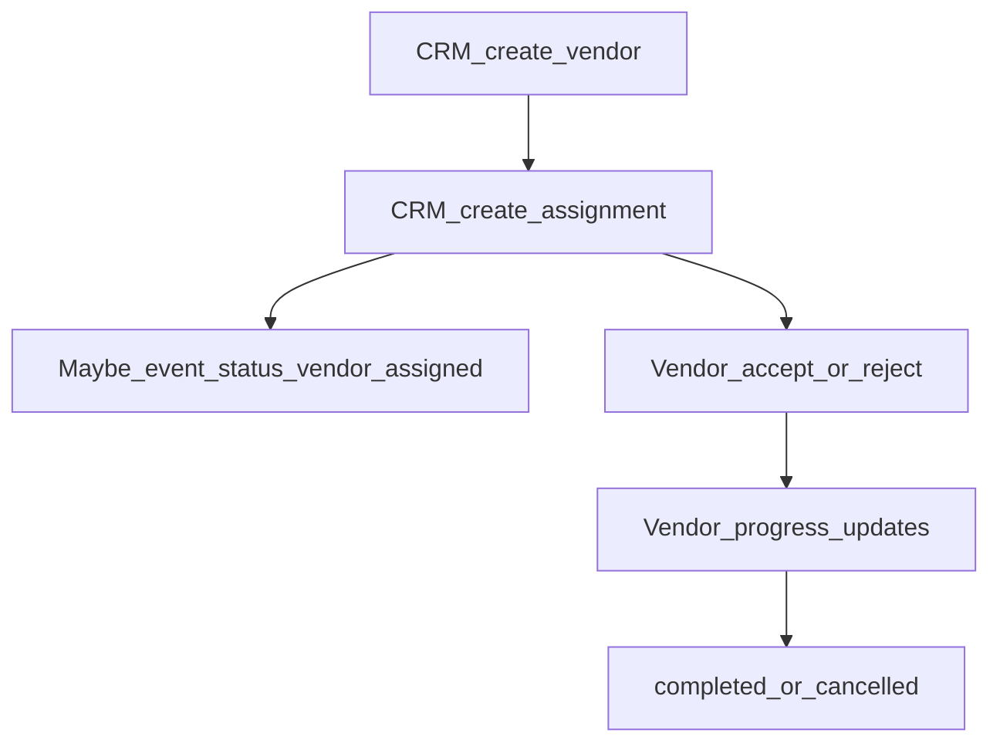

# Vendor Flow

CRM manages the vendor registry and event assignments. Vendors accept or reject
work and report progress on self routes.

Routes: [vendor API](../04-api/vendor.md).

---

## Flow

---

## Steps

| Step                   | Actor        | API                                               | Effect                                                      |
| ---------------------- | ------------ | ------------------------------------------------- | ----------------------------------------------------------- |
| Create / update vendor | CRM          | `POST/PATCH /api/v1/crm/vendors`                  | Registry row; Pattern B module history on controlled writes |
| Assign to event        | CRM          | `POST /api/v1/crm/vendors/assignments`            | Assignment created; may set event → `vendor_assigned`       |
| Update assignment      | CRM          | `PATCH …/assignments/:assignmentId`               | Status/notes from CRM                                       |
| Accept / reject        | Vendor       | `POST /vendors/me/assignments/:id/accept\|reject` | Assignment status change                                    |
| Progress               | Vendor       | `POST …/progress`                                 | Progress statuses (planning, on_site, working, …)           |
| Notes                  | CRM / Vendor | CRM `…/notes`, self `…/me/notes`                  | Notes                                                       |

Customers do not mutate vendors through the customer API (managed marketplace;
ERP assigns fulfilment).

---

## Statuses

From `packages/api-contracts` (among others):

- Vendor verification / active statuses on the registry
- `vendorAssignmentStatuses`: e.g. `invited`, `assigned`, `accepted`, `rejected`,
  `planning`, `travelling`, `on_site`, `working`, `completed`, `cancelled`

---

## Gaps

- Customer vendor marketplace / open selection — not this API surface
- Product feedback/reviews tables — not implemented here

---

## Related

- [event-lifecycle.md](./event-lifecycle.md)
- [worker-flow.md](./worker-flow.md)
- [finance-flow.md](./finance-flow.md) — vendor settlements
