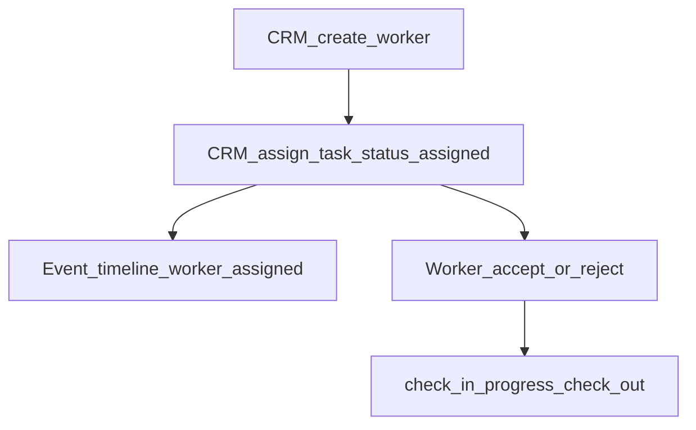

# Worker Flow

CRM manages workers and assigns event tasks. Workers accept or reject tasks and
report attendance/progress on self routes.

Routes: [worker API](../04-api/worker.md).

---

## Flow

Assigning a worker task writes an event **timeline** entry of type
`worker_assigned`. It does **not** automatically set
`event_records.status = worker_assigned` (CRM may advance status manually).

---

## Steps

| Step                            | Actor        | API                                            | Effect                                            |
| ------------------------------- | ------------ | ---------------------------------------------- | ------------------------------------------------- |
| Create / update worker          | CRM          | `POST/PATCH /api/v1/crm/workers`               | Registry                                          |
| Assign task                     | CRM          | `POST /api/v1/crm/workers/tasks`               | Task `assigned`; event timeline `worker_assigned` |
| List attendance                 | CRM          | `GET /crm/workers/attendance`                  | Read                                              |
| Accept / reject                 | Worker       | `POST /workers/me/tasks/:id/accept\|reject`    | Task status                                       |
| Check-in / progress / check-out | Worker       | `POST …/check-in`, `…/progress`, `…/check-out` | Attendance and task progression                   |
| Notes                           | CRM / Worker | CRM or `/workers/me/notes`                     | Notes                                             |

---

## Statuses

From `packages/api-contracts` (among others):

- Worker registry / availability / employment enums
- `workerTaskStatuses`: e.g. `assigned` → `accepted`/`rejected` → `travelling` →
  `checked_in` → `working` → `completed` → `checked_out` (+ `cancelled`)
- Attendance status enums for check-in records

---

## Gaps

- Automatic event status bump to `worker_assigned`
- Post-completion feedback/ratings product flow

---

## Related

- [event-lifecycle.md](./event-lifecycle.md)
- [operations-flow.md](./operations-flow.md)
- [finance-flow.md](./finance-flow.md) — worker payouts
- [vendor-flow.md](./vendor-flow.md)
