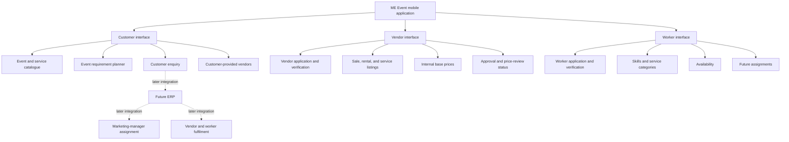

# ME Event Mobile Application Architecture v1

- Status: approved; connected implementation started
- Scope: one role-based mobile application connected to the shared platform
- ERP status: active in parallel through end-to-end vertical slices
- Authentication/backend integration: Phase 1 foundation

## Product definition

ME Event is one mobile application with three role interfaces:

```text
Customer - available by default after future authentication
Vendor - available only after application and ME Event approval
Worker - available only after application and ME Event approval
```

One person may hold Customer, Vendor, and Worker roles simultaneously. This is
role switching inside one account, not separate account creation.

## Phase 1 implementation boundary

The first implementation phase builds the three role interfaces, the Employee
CRM/ERP foundation, and their shared backend bootstrap. Safe local fixture data
is permitted only in the clearly labelled development role preview.

Until the relevant connected slice is delivered, it does not claim to provide:

- Real login or OTP verification
- Production database persistence
- Production vendor/worker approval
- Live payments or settlements
- Real customer enquiries
- Live ERP assignment or tracking

A development-only role preview may be used to inspect each interface. It must
be excluded from production builds once authentication is introduced.

## Operating model

ME Event operates a managed platform:

- Approved vendors may offer products for sale, products for rent, and services.
- ME Event controls listing approval, vendor disclosure, and final customer
  prices.
- Customers browse and submit requirements through ME Event.
- Customers may attach a preferred external vendor privately to an enquiry.
- Marketing managers will later be assigned and tracked through the ERP.
- ME Event later decides internal fulfilment across company inventory, vendors,
  and workers.
- Customer journeys end at an ME Event offering and enquiry, not at vendor
  selection. The future ERP may compare multiple eligible vendors and assign the
  appropriate fulfilment source.

## Application context map



## Role lifecycle

### Account role states

```text
not_applied
  -> draft
  -> submitted
  -> under_review
  -> changes_requested
  -> resubmitted
  -> approved
  -> suspended
  -> revoked
```

Rejection is recorded with a reason and an explicit reapplication policy. An
approved user may hold both Vendor and Worker roles.

### Role switching

Future authenticated behavior:

- Customer is the default available role.
- Only approved Vendor and Worker roles appear in the switcher.
- The current role is always visible.
- Switching clears role-specific navigation and sensitive cached data.
- The last active approved role is remembered.
- Role switches are auditable.

During interface prototyping, these rules are represented by local fixture states
only.

## Customer journey

```text
Discover
  -> Choose an event type
  -> Choose a function or ceremony
  -> Browse suggested services, products, and deals
  -> View offering details and ME Event price
  -> Add requirements to the event plan
  -> Enter date, time, location, guest count, and notes
  -> Optionally add a preferred external vendor
  -> Review the complete requirement
  -> Submit enquiry
  -> Await marketing-manager contact
```

The customer does not directly select individual workers. Customer-visible vendor
identity depends on the ME Event-controlled visibility policy.

## Vendor journey

```text
Customer account
  -> Choose "Become a Vendor"
  -> Select sale, rental, service, or any combination
  -> Enter business, service-area, and verification details
  -> Upload required evidence
  -> Create initial listings and base prices
  -> Submit for review
  -> ME Event verifies application and listings
  -> Approval activates Vendor role
  -> Vendor manages listings and proposed price changes
```

Vendor-facing price screens show:

- Current vendor base price
- Pending proposed base price
- Review status and feedback
- Effective date of approved price

They must not imply that the vendor controls the final customer price.

## Worker journey

```text
Customer account
  -> Choose "Become a Worker"
  -> Select skills and service categories
  -> Enter identity, experience, location, and availability
  -> Upload required evidence
  -> Submit for review
  -> ME Event verifies application
  -> Approval activates Worker role
  -> Worker maintains availability
  -> Future phase: receives and completes assignments
```

The detailed attendance, proof-of-work, incident, and earnings workflows remain
proposed until worker operations are documented.

## Listing lifecycle

```text
draft
  -> submitted
  -> under_review
  -> changes_requested
  -> approved
  -> published
  -> paused
  -> archived
```

A published listing may have a separate pending revision. The published version
remains customer-visible while the revision is reviewed.

### Price lifecycle

```text
Vendor base price submitted
  -> price_review
  -> approved or rejected

Approved vendor base price
  -> ME Event sets customer price
  -> customer price published
  -> price captured in enquiry/quotation/deal snapshot
```

Vendor price, customer price, percentage, margin, and settlement information are
separate permission domains.

## Vendor disclosure policy

`vendor_visibility` is controlled only by ME Event.

Supported policy:

- `hidden`: show ME Event identity and contact details.
- `disclosed`: show approved vendor identity and allowed contact details.

The backend must filter prohibited fields. Hiding a widget in the mobile
interface is not a security control.

Every policy change requires:

- Actor and timestamp
- Previous and new value
- Reason
- Scope
- Audit event

## Enquiry model

An enquiry contains:

- Customer and event-plan reference
- Event type and functions
- Date/time, location, guest count, and budget guidance
- Selected service requirements
- Selected catalogue listing references and captured versions
- Free-form notes and attachments
- Customer-provided preferred vendors
- Consent and contact preference
- Submission and status history

Initial customer statuses:

```text
draft
submitted
received
contact_pending
in_discussion
proposal_expected
closed
cancelled
```

The later ERP may own expanded internal pipeline states, but customer-visible
statuses remain stable and understandable.

## Future ERP integration boundary

The mobile application will eventually emit or expose:

- Customer enquiry submitted
- Preferred vendor attached
- Customer contact preference changed
- Proposal viewed
- Deal accepted or rejected
- Payment and cancellation events

The ERP will later own:

- Marketing-manager assignment
- Calls, meetings, and follow-ups
- Internal qualification and costing
- Customer quotation preparation
- Fulfilment decisions
- Vendor and worker allocation
- Approvals, collections, settlements, and operational reporting

ERP internal data must not leak into customer APIs merely because the products
share a backend platform.

## Quality and safety requirements

Every interface screen requires:

- Loading, empty, populated, and error states
- Offline behavior
- Permission and approval-state behavior
- Accessible labels and touch targets
- Retry behavior
- Analytics event definition
- No exposure of internal prices, verification files, or staff notes

## Architecture approval gates

Interface coding should begin only after approval of:

1. Navigation and screen map
2. Catalogue hierarchy
3. Customer enquiry fields
4. Vendor onboarding evidence
5. Worker onboarding and initial operating scope
6. Vendor disclosure behavior
7. Prototype visual direction
