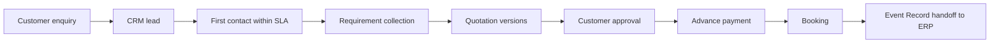

# CRM PRD v1

- Status: accepted
- Date: 2026-08-01
- Parent: `00-master-prd-v1.md`
- Surface: `employee_web` in `apps/erp-web` (Next.js)
- Related: ADR 0010 (slices 2-3), PRD 01 (customer enquiry),
  PRD 05 (ERP handoff)

## 1. Purpose

The CRM turns every customer enquiry into a structured and measurable sales
process: lead capture, ownership, follow-up within SLA, requirement
collection, quotation, approval, advance payment, and conversion to a
booking. It is operated by the sales/marketing team inside the Employee
CRM/ERP web application.

## 2. Pipeline overview

Customer-visible statuses (PRD 01, section 4.4) remain stable and simple.
The CRM owns the expanded internal pipeline states and maps them to the
customer-visible set; internal states must never leak into customer APIs.

## 3. Functional requirements

### 3.1 Lead capture and sources

- Every submitted customer enquiry automatically creates exactly one lead
- Manual lead creation for walk-in, phone, referral, and campaign sources
- Lead source tracking on every lead (`mobile_app`, `walk_in`, `phone`,
  `referral`, `campaign`, `other`)
- Duplicate detection by customer mobile number and open enquiry

### 3.2 Ownership and SLA

- New leads enter an unassigned inbox for the branch
- A marketing/sales employee takes or is assigned ownership; ownership
  changes are audited
- First-response SLA is configurable per branch
  (`branch_settings` key `lead.first_response_sla_minutes`, seeded at 10
  minutes for Hyderabad); the CRM shows SLA countdowns and breaches
- Team workload view for managers with reassignment controls

### 3.3 Lead working

- Customer profile: identity, contact preference, enquiry history, saved
  plans, and prior deals
- Enquiry detail: event type, functions, date/time, location, guest count,
  budget guidance, selected services, captured listing versions, attachments,
  and customer-provided preferred vendors (private)
- Call logs, meeting notes, and activity history (append-only)
- Follow-up reminders with due dates and notification to the owner
- Status tracking through the internal pipeline; every transition records
  actor, timestamp, and reason where applicable

### 3.4 Quotation (slice 3)

- Quotation creation from the enquiry with line items priced from the
  Mee Events customer-price catalogue (price snapshots, never live references)
- Quotation revisions as immutable versions; the customer always sees the
  latest sent version and its validity
- Internal approval workflow before sending when the discount or margin
  crosses configured thresholds
- Customer approval/decline recorded with an auditable event
- Advance payment tracking against the payment plan

### 3.5 Conversion and closure

- Approved quotation plus advance payment converts the lead to a booking
- Booking triggers the Event Record handoff to the ERP (PRD 05)
- Lost/closed leads require a reason code
- Feedback captured at closure

## 4. Reporting

- Total leads, by period, source, owner, and status
- First-response SLA compliance
- Booking conversion rate (lead to booking)
- Pending quotation count and quotation ageing
- Revenue summary from converted deals
- Follow-up discipline (overdue follow-ups per owner)

## 5. Access control

- CRM modules are available to employees whose bootstrap policy includes the
  `crm_leads`, `crm_customers`, and `crm_quotations` modules
- Capabilities: `crm_lead.read`, `crm_lead.update`, `crm_lead.assign`,
  `crm_customer.read`, `crm_quotation.manage`
- Data scope: Hyderabad branch and assignment
  (`hyderabad-branch-and-assignment`)
- Every controlled mutation writes an audit event

## 6. Out of scope

- Marketing automation and campaign execution
- Cross-branch pipelines (single branch in Phase 1)
- Customer-facing communication channels other than those defined in PRD 01

## 7. Acceptance criteria

- A submitted mobile enquiry appears in the CRM lead inbox within seconds
- A marketing employee can take ownership and the customer status changes
  accordingly on the mobile app
- SLA countdowns reflect the configurable branch setting
- A quotation can be created, revised, sent, and approved with immutable
  version history
- Conversion produces a booking and an Event Record handoff
- All reports reconcile with the underlying transactional data
