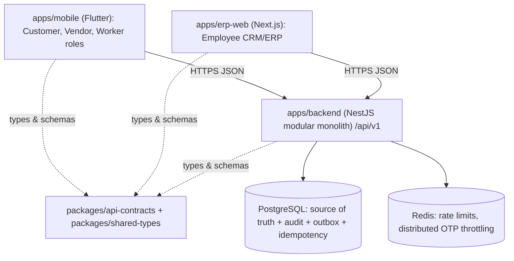

# Technical Architecture PRD v1

- Status: accepted
- Date: 2026-08-01
- Parent: `00-master-prd-v1.md`
- Related: ADR 0001, ADR 0002, ADR 0003, ADR 0004, ADR 0005, ADR 0010,
  ADR 0011

## 1. System overview



One backend serves all surfaces. Clients never talk to the database
directly. The database is authoritative; real-time updates and push
notifications only inform clients that a record changed (ADR 0010
synchronization rule).

## 2. Monorepo layout

```text
apps/
  mobile/        Flutter app (outside the pnpm workspace; Flutter SDK 3.x+)
  backend/       NestJS modular monolith
  erp-web/       Next.js Employee CRM/ERP
  customer-web/  Archived web prototype (reference only, separate build)
packages/
  api-contracts/ Zod schemas, response types, capability and module catalogs
  shared-types/  Platform roles, identity types
infrastructure/
  postgres/      Versioned SQL migrations
  docker-compose.yml  Postgres 17 + Redis 7 for local development
```

pnpm workspace members: `apps/backend`, `apps/erp-web`, `packages/*`.

## 3. Backend architecture

- NestJS modular monolith (ADR 0001): each module owns its domain logic and
  exposes interfaces so it can be extracted into a service later without a
  rewrite
- Module layout convention (see `src/modules/identity/`):

```text
modules/<name>/
  presentation/   controllers (HTTP, versioned)
  application/    services (use cases)
  domain/         entities, value objects, pure logic
  ports/          repository/provider interfaces
  adapters/       Postgres, in-memory, external providers
  security/       guards specific to the module
```

- Global setup (`src/main.ts`): `api` prefix, URI versioning (`v1`), CORS,
  Swagger at `/api/docs`, global exception filter with stable error codes
  and request ids (ADR 0004)
- Validation: Zod schemas from `packages/api-contracts` applied through the
  shared validation pipe at the boundary
- Persistence: repositories behind ports (ADR 0005); Postgres adapters use
  the `pg` driver against the migration-defined schema; in-memory adapters
  remain only for tests
- Cross-cutting foundations: append-only audit sink, outbox writer, and
  idempotency handling are shared services every domain module uses for
  controlled mutations

## 4. Identity and sessions (ADR 0002)

- OTP login on E.164 mobile numbers; OTP digests are keyed HMACs with
  attempt limits, TTL, and one-time consumption; the local OTP provider is
  forbidden in production
- Access tokens: short-lived JWTs carrying `sub` (user), `sid` (session),
  and `role` (active role)
- Refresh tokens: opaque, HMAC-digested at rest, bound to revocable
  `device_sessions`, rotated on every use; reuse of a rotated token revokes
  the session
- Endpoints: `POST /auth/otp/request`, `POST /auth/otp/verify`,
  `POST /auth/refresh`, `POST /auth/logout`
- `AccessTokenGuard` verifies the JWT, loads the session and user, checks
  revocation/expiry and active role assignment, then attaches the
  authenticated principal

## 5. Authorization

- The platform bootstrap (`GET /platform/bootstrap`) returns the actor,
  branch, surface, landing module, active role assignments, capabilities,
  and module definitions; clients render navigation from it and never
  hard-code role logic
- Every controlled endpoint enforces capabilities server-side; UI hiding is
  not a security control
- Data scope in Phase 1: Hyderabad branch and assignment
- Field-level filtering: customer responses never include vendor base
  prices, margins, internal notes, or verification documents

## 6. API contracts (ADR 0004)

- External HTTP APIs live under `/api/v1`; breaking changes require a new
  version
- `packages/api-contracts` is the wire contract shared by backend and
  erp-web; the Flutter app mirrors the same shapes in
  `apps/mobile/lib/models/`
- Errors: stable `code`, safe `message`, `status`, `requestId`, optional
  field `details`; no stack traces in production

## 7. Reliability patterns

- Audit: every controlled mutation appends to `audit_events` in the same
  transaction as the change
- Outbox: events that other systems react to are written to `outbox_events`
  in the same transaction and delivered by a publisher
- Idempotency: client-retryable writes require an `Idempotency-Key` header;
  the shared handler stores request hashes and replays cached responses
- Optimistic concurrency: mutable business tables carry `version`; writers
  compare-and-set

## 8. Environments and configuration (ADR 0003)

- `development`, `staging`, and `production` use separate databases,
  credentials, domains, and signing identities
- Backend configuration is validated at startup (`src/config/environment.ts`,
  Zod); missing or invalid configuration fails fast
- Secrets are never committed and never embedded in client builds; clients
  receive only public configuration (API base URL) via build-time defines

## 9. Frontend integration

- Flutter: Riverpod for state, imperative navigation, `ApiClient` +
  `MobileApi` in `lib/api/` for backend calls; session storage in secure
  storage; bootstrap response drives role navigation
- ERP web: Next.js App Router; `loadEmployeePlatformBootstrap` validates the
  `employee_web` surface; authenticated fetches attach the access token

## 10. Acceptance criteria

- All writes flow through capability-guarded backend commands
- Identity endpoints run against PostgreSQL with refresh rotation and logout
  before any production deployment
- Every domain module ships with unit tests for domain logic and integration
  tests for controllers
- `pnpm verify` (build, lint, typecheck, test) passes on every change
